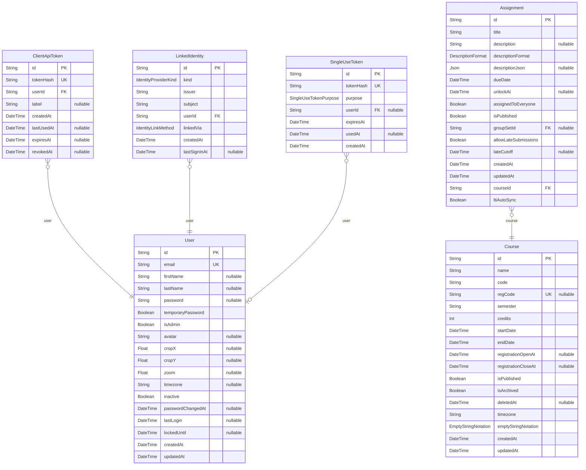
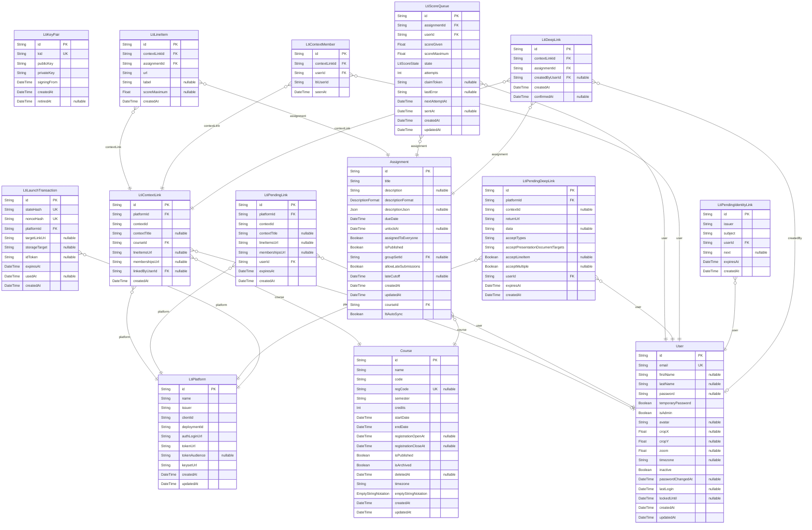
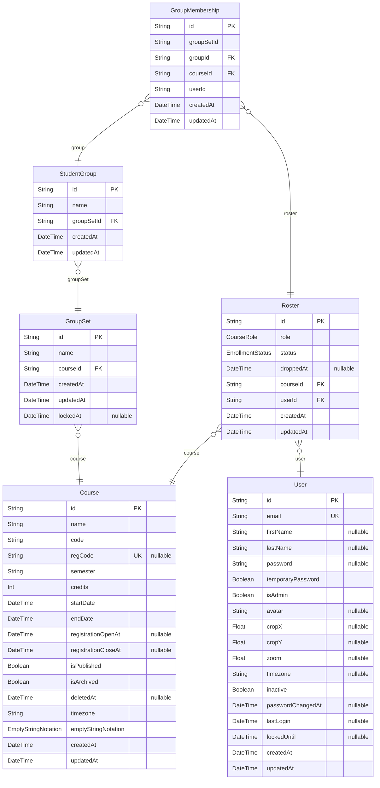
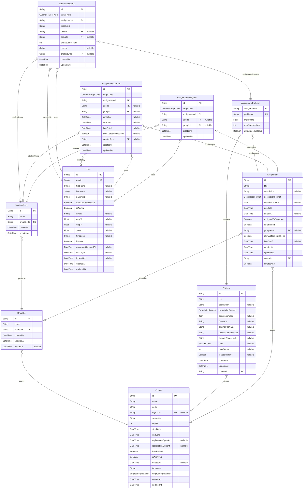
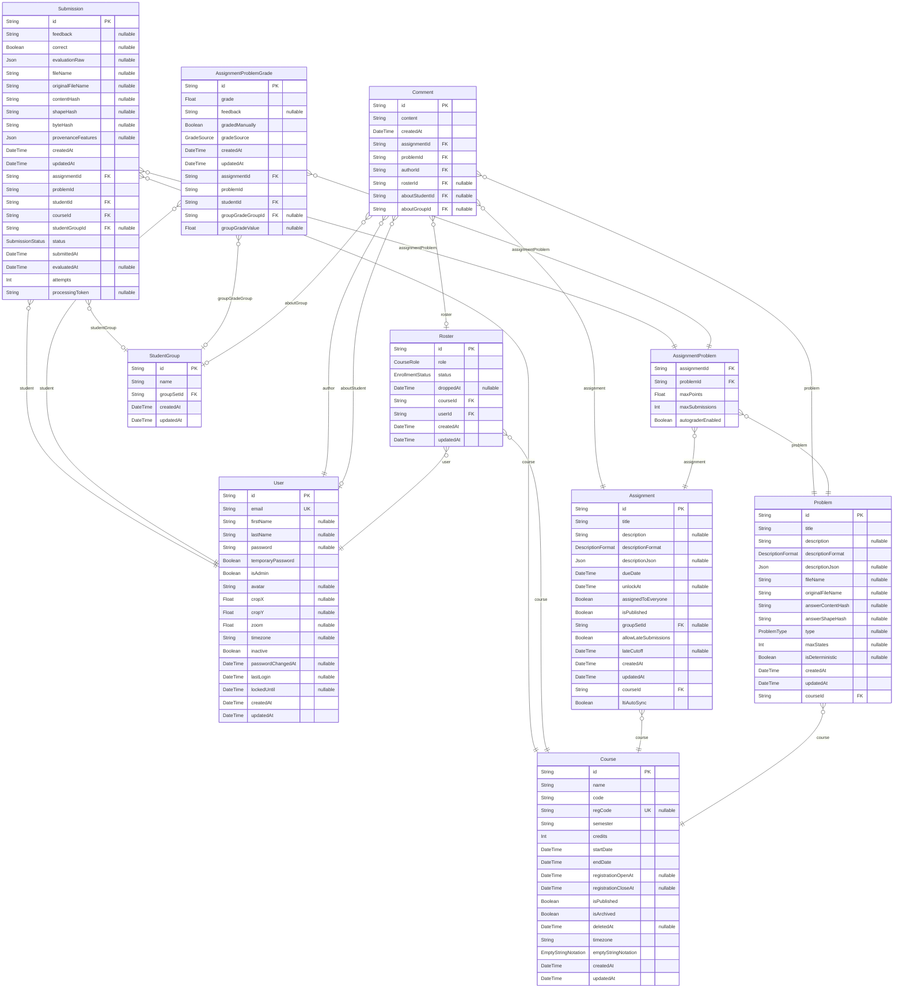
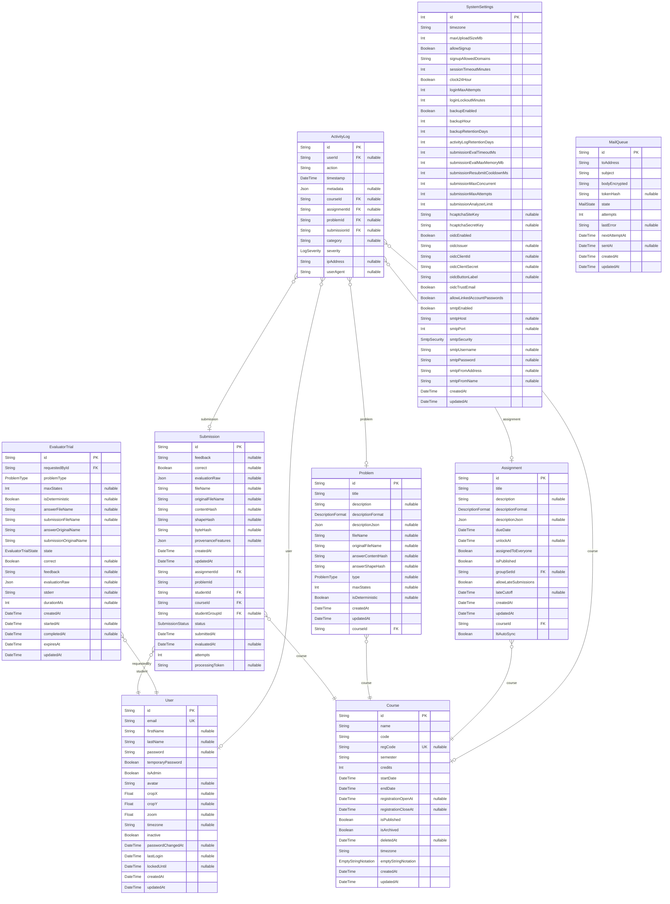

# Database schema

> Generated by [`prisma-markdown`](https://github.com/samchon/prisma-markdown)

- [Identity](#identity)
- [LTI](#lti)
- [Courses](#courses)
- [Assignments](#assignments)
- [Submissions](#submissions)
- [System](#system)

## Identity

### `User`

A person with an account: student, teaching assistant, faculty member or system
administrator. One account is used across every course; what a person may do in a given
course comes from their Roster row, not from this record.

Properties as follows:

- `id`: Unique identifier.
- `email`: Sign-in address, and the identifier the institution's systems recognise.
- `firstName`: Given name.
- `lastName`: Family name.
- `password`
  > bcrypt hash of the local password, or null for an account that has none. The plain
  > password is never stored.
  >
  > Optional because an account will be able to exist without one: an identity provider or an
  > LMS launch can vouch for someone who never chose an AFCT password. Nothing creates such an
  > account yet, but every reader must already treat null as "cannot sign in with a password"
  > rather than assume a string is there.
- `temporaryPassword`: Whether the current password was issued by an administrator and must be changed at next sign-in.
- `isAdmin`
  > Whether this account administers the installation. What a person may do inside a particular
  > course comes from their Roster row instead; this is the only privilege that is global.
- `avatar`: Uploaded profile image, if any.
- `cropX`
  > How the avatar is framed. The uploaded image is stored unchanged and the framing is applied
  > when it is displayed, so re-cropping never needs a re-upload.
- `cropY`: Vertical framing of the avatar.
- `zoom`: Zoom level applied to the avatar.
- `timezone`: Preferred timezone for displaying times. Falls back to the installation default.
- `inactive`: Whether the account has been disabled. An inactive account cannot sign in but its records remain.
- `passwordChangedAt`
  > When the password was last changed. Sessions issued before this moment stop being accepted,
  > so a password reset ends any session an intruder already had rather than leaving it valid
  > until it expires.
- `lastLogin`
  > Last successful sign-in. Stored on the account rather than derived from the activity log, so
  > it survives log pruning.
- `lockedUntil`
  > When a temporary lockout ends, after too many failed sign-in attempts. The lock clears
  > itself once the time passes, and an administrator can lift it early. Empty means the account
  > is not locked.
- `createdAt`: When this record was created.
- `updatedAt`: When this record was last changed.

### `ClientApiToken`

Bearer token for the native submission client. The browser signs in with a session cookie;
the desktop client authenticates with one of these instead. Only a hash of the token is
stored, and the plaintext is shown once when it is issued. Tokens can be revoked and can
expire, so a lost machine or an outdated client can be cut off without changing the owner's
password.

Properties as follows:

- `id`: Unique identifier.
- `tokenHash`: Hash of the token. The token itself is shown once when issued and never stored.
- `userId`: The account the token acts as.
- `label`: Optional name for the token, so its owner can tell devices apart.
- `createdAt`: When this record was created.
- `lastUsedAt`: When the token was last used, so unused tokens can be spotted.
- `expiresAt`: When the token stops working. Empty means it does not expire on its own.
- `revokedAt`: When the token was withdrawn. Once set, the token is refused.

### `LinkedIdentity`

An institutional identity mapped to an AFCT account: an OIDC sign-in, or a person arriving
through an LMS launch.

Accounts stay the unit of identity in AFCT. This does not become a parallel user table; it
records that some outside system vouches for a person who already has an account here.

**Keyed on issuer plus subject, never email.** The subject is the provider's stable
identifier for a person, so a link survives a name change, a marriage, or a department
moving someone's address. Email is used once, to *find* the account to attach to, and is
not what holds the link together afterwards.

Properties as follows:

- `id`: Unique identifier.
- `kind`:
- `issuer`: The provider's own name for itself: an OIDC issuer URL, or an LTI platform issuer.
- `subject`: The provider's stable identifier for this person (the `sub` claim). Never an email.
- `userId`: The AFCT account this identity signs in as.
- `linkedVia`: How the link came to exist.
- `createdAt`: When this record was created.
- `lastSignInAt`: Last time somebody signed in through it, so a stale link can be spotted.

### `SingleUseToken`

A token that works exactly once, within a time window: the password-reset link today, and
the shape anything similar should reuse.

Only the SHA-256 hash is stored, so a leaked database, or a leaked backup, does not hand
anyone a working link. "Used exactly once" is enforced by a conditional update on `usedAt`
rather than by reading and then writing, so two simultaneous clicks on the same link cannot
both succeed.

Properties as follows:

- `id`: Unique identifier.
- `tokenHash`: sha256(token), never the plaintext.
- `purpose`: What the token authorises. A token issued for one purpose is refused for another.
- `userId`
  > Who the token is for. Optional because not every future purpose has a user behind it
  > (an LTI launch nonce, for instance, is issued before anyone is identified).
- `expiresAt`: When the token stops working.
- `usedAt`: When it was spent. Once set, the token is refused.
- `createdAt`: When this record was created.

## LTI

### `LtiPlatform`

An LMS that may launch into AFCT.

Registration is mutual and manual: an administrator creates a developer key in the LMS, and
pastes what it gives back into AFCT. There is no client secret, because LTI 1.3 does not use
one; AFCT proves who it is by signing with its own key.

Keyed on the **triple** of issuer, client id and deployment id rather than on the issuer
alone. One LMS can deploy the same tool more than once (a sub-account, a second course set),
and each deployment is a distinct registration even though the issuer and client id repeat.
Treating the issuer as the key is the classic way to make two deployments collide.

Properties as follows:

- `id`: Unique identifier.
- `name`: What an administrator calls this LMS, for screens. Never used for matching.
- `issuer`: The platform's own issuer identifier, which appears as `iss` in every launch.
- `clientId`: What the LMS calls AFCT. Appears as `aud` in a launch.
- `deploymentId`: Which deployment of AFCT within that LMS this is.
- `authLoginUrl`: Where AFCT sends the person to start a launch (the platform's OIDC authorization endpoint).
- `tokenUrl`: Where AFCT asks for access tokens, for grade passback and roster sync.
- `tokenAudience`
  > The audience to name in the client-assertion JWT, when the platform wants one of its own.
  >
  > Almost every platform expects the token endpoint itself, which is what AFCT uses when this is
  > empty: Canvas, Moodle and Blackboard all do, the last confirmed from Blackboard's own sample
  > tool. D2L Brightspace is the exception. Its registration hands out a `BrightspaceAudience`
  > separately from the access token URL, and an assertion addressed to the endpoint instead is
  > refused, so nothing AFCT sends to a Brightspace course would ever arrive.
- `keysetUrl`: Where AFCT fetches the platform's public keys, to verify that a launch really came from it.
- `createdAt`: When this record was created.
- `updatedAt`: When it was last changed.

### `LtiKeyPair`

AFCT's own signing keypair, used to sign the token requests it makes to an LMS.

This is the one secret whose loss is not just a re-typing job. An LMS is registered against
the public half, which it fetches from AFCT's JWKS endpoint and caches, so losing the private
half means generating a new keypair and re-registering AFCT with every platform.

Several rows can be published at once, which is what makes rotation possible without an
outage: a new key is published and given time to be picked up before anything is signed with
it, and the old one stays published until nothing signed by it is still in flight.

Which key signs is **derived, not stored**: it is the newest published row whose
`signingFrom` has passed. There is deliberately no "is the signing key" flag, because a flag
would be an invariant needing a database guard and two concurrent rotations could break it.
Nothing here can disagree with itself.

The private half is encrypted at rest like every other secret. The public half is not,
because publishing it is the entire point.

Properties as follows:

- `id`: Unique identifier.
- `kid`
  > The `kid` in the published JWKS and in the header of every token AFCT signs. This is how
  > a platform decides which published key to verify a token against, so it never changes.
- `publicKey`: PEM, published to anyone who asks.
- `privateKey`: PEM, encrypted at rest. Never leaves the server.
- `signingFrom`
  > When this key becomes eligible to sign. Set ahead of time to give platforms a chance to
  > fetch it first; a platform that has not refreshed its cache cannot verify a token signed
  > by a key it has never seen.
- `createdAt`: When this record was created.
- `retiredAt`
  > When it stopped being published. Set rather than deleted, so a token still in flight can
  > be traced to the key that signed it.

### `LtiContextLink`

Which AFCT course an LMS course opens into.

Created the first time somebody who can link launches from an unlinked LMS course, and
remembered afterwards so nobody is asked twice.

**Many LMS courses may point at one AFCT course.** Cross-listed sections are separate courses
in the LMS and one course to the department, and forcing them apart would split one roster in
two. The reverse is refused by the unique constraint: one LMS course opening two AFCT courses
has no answer to "which one did they mean".

Properties as follows:

- `id`: Unique identifier.
- `platformId`: Which registration the launch came through.
- `contextId`: The LMS's own identifier for its course, from the launch's context claim.
- `contextTitle`: What the LMS calls it, kept for screens so an admin can recognise a link.
- `courseId`: The AFCT course it opens.
- `lineItemsUrl`
  > Where to create gradebook columns for this LMS course, from the launch's AGS claim.
  > Null when the platform granted no grade scopes. Refreshed on each launch.
- `membershipsUrl`
  > Where to read this LMS course's membership, from the launch's NRPS claim. Null when the
  > platform granted no roster scope. Refreshed on each launch.
- `linkedByUserId`: Who decided this. Null once that account is gone; the link outlives the person.
- `createdAt`: When this record was created.

### `LtiPendingLink`

A launch that arrived from an LMS course nobody has linked yet, waiting for someone to say
which AFCT course it is.

The launch details live here rather than travelling through the browser in a URL. If they
were in the URL, faculty could edit the LMS course identifier and pre-link a *different*
LMS course to their own AFCT course, capturing every launch from it afterwards. Held here,
the identifier is the one the platform actually signed.

Short-lived, and scoped to the person the launch signed in: this is a step in a flow, not a
record of anything.

Properties as follows:

- `id`: Unique identifier, and what the browser is handed to name this pending link.
- `platformId`: Which registration the launch came through.
- `contextId`: The LMS's own identifier for its course, exactly as the platform signed it.
- `contextTitle`: What the LMS calls it, shown on the picker so faculty know what they are linking.
- `lineItemsUrl`
  > Where grades and the roster are read and written for this course, carried from the launch
  > that offered the link.
  >
  > They have to travel with the pending row because only a launch is given them: they arrive
  > as claims in the signed token, and the browser that comes back to choose a course a minute
  > later brings nothing. Without them the link was stored with both set to null, and grades
  > then failed against a message blaming the LMS for permissions it had already granted.
- `membershipsUrl`:
- `userId`: Who the launch signed in. Only they can act on it.
- `expiresAt`: When this stops being usable.
- `createdAt`: When this record was created.

### `LtiLineItem`

One AFCT assignment's gradebook column in an LMS course.

Created on demand the first time a grade is sent, and remembered so later grades go to the
same column instead of making a new one each time.

Properties as follows:

- `id`: Unique identifier.
- `contextLinkId`: The LMS course this column lives in.
- `assignmentId`: The AFCT assignment it scores.
- `url`: The platform's URL for this column, used to post scores.
- `label`
  > What the column was last told it is called and worth. Kept so a renamed assignment, or one
  > whose points changed, can be corrected in the LMS: a score is scaled against the column's
  > maximum, so a stale one silently misreports every grade.
- `scoreMaximum`:
- `createdAt`: When this record was created.

### `LtiScoreQueue`

A grade on its way to an LMS gradebook.

Written in the same breath as the grade itself and sent afterwards, rather than posted
inline. An LMS that is slow, down or rate-limiting must never make grading fail or hang, and
a grade that did not arrive has to be visible rather than lost in a log.

One row per assignment per student: a regrade replaces the pending row instead of queueing a
second, so the LMS receives the current grade rather than a history of edits.

Properties as follows:

- `id`: Unique identifier.
- `assignmentId`: The assignment being scored.
- `userId`: The student whose grade this is.
- `scoreGiven`: The grade, and what it is out of, captured when it was queued.
- `scoreMaximum`:
- `state`:
- `attempts`: How many times sending has been tried. Drives the backoff and the give-up point.
- `claimToken`
  > Which send owns this row, as a random value written when a sender claims it.
  >
  > A sender that finishes must only record its own outcome. Without this, a grade changed
  > while a send was in flight was overwritten by that send's result: the queue row is reused
  > for the new grade, so the old sender marked the *new* score SENT and logged it as
  > delivered, while the LMS held the old one and nothing ever sent the new one. A counter
  > cannot fix it, because re-queuing resets the counter to a value a live sender still holds;
  > a random token never comes round again. Cleared when the row is re-queued, which is what
  > fences the sender that is still running.
- `lastError`: Why the last attempt failed, for the screen that shows faculty what happened.
- `nextAttemptAt`: Not before this time. Set into the future to back off after a failure.
- `sentAt`: When the LMS accepted it.
- `createdAt`: When this record was created.
- `updatedAt`: When it was last changed.

### `LtiPendingDeepLink`

A deep-linking request waiting for somebody to choose an assignment.

The return URL and the platform's opaque state are held here rather than passed through the
browser. In a URL, somebody could change where AFCT posts its signed answer, and AFCT signs
that answer with its own key.

Properties as follows:

- `id`: Unique identifier, and what the browser is handed to name this pending choice.
- `platformId`: Which registration asked.
- `contextId`: The LMS course it was asked from, so the picker can offer that course's assignments.
- `returnUrl`: Where the signed answer is posted, exactly as the platform gave it.
- `data`: The platform's own opaque state, returned untouched or the response is rejected.
- `acceptTypes`
  > What the platform said it will accept, from the deep linking settings claim. Required by
  > Deep Linking 2.0, so never empty: a request without it is refused at launch.
- `acceptPresentationDocumentTargets`
  > How the platform is prepared to display what it is given. Also required by Deep Linking
  > 2.0. AFCT has nothing to decide from it yet and keeps it anyway, because dropping a
  > required part of the request would make it unrecoverable if that ever changes.
- `acceptLineItem`
  > Whether a gradebook column may come with the link. Three states, and null is the important
  > one: Deep Linking 2.0 says that when accept_lineitem is absent "no assumption can be made
  > about the support of line items", so it is not the same as true and AFCT sends a line item
  > only when the platform has said so outright.
- `acceptMultiple`
  > Whether the platform will take more than one item back, with null for a request that did
  > not say. AFCT returns one assignment per response, so this changes nothing today; it is
  > stored because it is the platform's own statement of what it supports, and multi-assignment
  > selection would need it.
- `userId`: Who the launch signed in. Only they can answer it.
- `expiresAt`: When this stops being usable.
- `createdAt`: When this record was created.

### `LtiLaunchTransaction`

One LTI launch, from the login the platform initiates to the token it posts back.

The state and the nonce used to be two unrelated single-use tokens, which proved each was
AFCT's and unspent but never that they belonged to the same launch. Holding them on one row
with the platform and the target link URI is what lets the returning token be checked
against the login that started it, which LTI Core requires and which two loose tokens
cannot express. Consuming the row is also the single point at which a launch is spent.

Properties as follows:

- `id`: Unique identifier.
- `stateHash`: sha256(state), never the plaintext. The value handed to the browser and posted back.
- `nonceHash`: sha256(nonce), never the plaintext. The value the platform copies into the id_token.
- `platformId`: The registration this launch was started against; the token must match it.
- `targetLinkUri`
  > The target link URI the platform sent to the login endpoint, when it sent one. Core says
  > the signed token's own target link URI must equal this.
- `storageTarget`
  > The frame the platform named for its browser storage, when it offered any.
  >
  > Set from `lti_storage_target` at login. Its presence is what says this platform can hold a
  > value for AFCT in the browser, which is the only route left when a browser refuses the
  > state cookie outright. Absent means cookies are the only mechanism available.
- `idToken`
  > The signed token, held only while a launch waits for the browser to answer for its state.
  >
  > A launch that arrives without its cookie cannot be finished on that request: the answer is
  > in the platform's browser storage and only a page can read it. Rather than hand the token
  > back through the browser to be posted again, it waits here for the seconds that takes, and
  > is cleared the moment the launch is spent or expires.
- `expiresAt`: When the launch stops being completable.
- `usedAt`: When it was spent. Once set, the launch is refused as a replay.
- `createdAt`: When this record was created.

### `LtiContextMember`

Which LMS course a person is in, so a grade goes to the right gradebook.

One AFCT course can be opened from several LMS courses (cross-listed sections). Without
this, grade passback had to guess: it tried each link in turn and let the platform refuse
the wrong ones, but the first thing it does is create a gradebook column, so a student from
one section could put an AFCT column in another, and a student in both got their grade
wherever the query happened to order first. Recorded on every launch and on every roster
sync, which are the two moments the LMS tells AFCT who is in which course.

Properties as follows:

- `id`: Unique identifier.
- `contextLinkId`: The LMS course this membership is in.
- `userId`: The AFCT account.
- `ltiUserId`: The LMS's own id for this person in this context, which is what a score is posted against.
- `seenAt`: When AFCT last saw evidence they belong here, from a launch or a roster read.

### `LtiPendingIdentityLink`

A launch that matched an AFCT administrator, waiting for them to prove it is them.

An administrator account is never attached to an LMS identity automatically, because the
match rests on an email the LMS asserts, and AFCT cannot see how carefully that address was
verified. For a student that would expose one person's work; for an administrator it would
hand over every student record in the system.

Refusing outright left them nowhere to go, so the launch pauses here instead: they type
their AFCT password, which is the one thing an LMS cannot assert, and the link is then a
deliberate act rather than an automatic one. Short-lived, single use, and useless to
anybody who cannot also sign in as that account.

Properties as follows:

- `id`: Unique identifier, and what the browser is handed to name this pending confirmation.
- `issuer`
  > The platform's issuer and its own id for the person, exactly as the launch signed them.
  > Stored rather than re-derived: the confirmation must attach the identity that launched,
  > not whatever a later request claims.
- `subject`:
- `userId`: The administrator account the launch matched by email.
- `next`: Where the launch was headed, so confirming lands them where they were going.
- `expiresAt`: When this stops being usable.
- `createdAt`: When this record was created.

### `LtiDeepLink`

An AFCT assignment somebody added to an LMS course as a link.

Written when the deep linking response is returned, because that is the only moment AFCT
knows: from then on the link lives in the LMS and is never reported back. Without it the
picker cannot tell what it has already offered, and the same assignment can be added twice
under two names, which then disagree about which gradebook column is theirs.

A row written at that moment is a claim, not a fact, which is what `confirmedAt` records.

Properties as follows:

- `id`: Unique identifier.
- `contextLinkId`: The LMS course the link was added to.
- `assignmentId`: The AFCT assignment it opens.
- `createdByUserId`: Who added it. Null once that account is gone; the link outlives the person.
- `createdAt`: When this record was created.
- `confirmedAt`
  > When the LMS first opened this link, and so the first proof it accepted the response.
  > Null until then: AFCT signs a response and hands it to the browser, and whether the
  > platform stored it is never reported back. A refused response leaves a row here that
  > nothing in the LMS opens, which is why the picker treats these two states differently.

## Courses

### `Course`

A single offering of a course: one section, in one term, with its own roster, assignments
and grades. Deadlines are anchored to the course timezone so a due date means the same
instant for everyone enrolled.

Properties as follows:

- `id`: Unique identifier.
- `name`: Course title as students see it.
- `code`: Course code, for example "CMPSC 464".
- `regCode`: Self-registration code students enter to join, if self-registration is offered.
- `semester`: Term the course runs in, for example "Fall 2026".
- `credits`: Credit hours.
- `startDate`: First day of the course.
- `endDate`: Last day of the course.
- `registrationOpenAt`: When self-registration opens. Empty means it is open as soon as the course is published.
- `registrationCloseAt`: When self-registration closes. Empty means it stays open.
- `isPublished`: Whether students can see the course. Unpublished courses are visible to staff only.
- `isArchived`: Whether the course has been retired. Archived courses are read-only.
- `deletedAt`
  > When the course was deleted. A deleted course is kept so it can be recovered, but is hidden
  > from everyone except administrators. A course must be archived before it can be deleted.
- `timezone`
  > The timezone that anchors this course's deadlines. Times entered by staff are interpreted
  > here, so a due date falls at the same moment for every student regardless of where they are.
- `emptyStringNotation`: Which symbol this course uses for the empty string when displaying automata and languages.
- `createdAt`: When this record was created.
- `updatedAt`: When this record was last changed.

### `Roster`

One person's place in one course. This is where a role lives: the same account can be a
student in one course and a teaching assistant in another. It also carries the student's
standing, so a student who drops keeps their record and can be restored.

Properties as follows:

- `id`: Unique identifier.
- `role`: What this person does in the course: student, teaching assistant or faculty.
- `status`
  > A student's standing in the course. Applies to students only; staff remain enrolled. A
  > student who drops loses access but keeps this record and all their work, so re-enrolling
  > restores everything.
- `droppedAt`: When the student dropped, if they did.
- `courseId`: The course.
- `userId`: The person.
- `createdAt`: When this record was created.
- `updatedAt`: When this record was last changed.

### `GroupSet`

A named way of dividing a course into groups, for example "Project teams" or "Lab partners".
A course can have several, and an assignment chooses at most one. Once work has been
submitted or graded against a set, its groups are frozen so that changing them cannot alter
records after the fact.

Properties as follows:

- `id`: Unique identifier.
- `name`: Name of the set, for example "Project teams".
- `courseId`: The course the set belongs to.
- `createdAt`: When this record was created.
- `updatedAt`: When this record was last changed.
- `lockedAt`
  > When this set's groups were frozen. Set automatically the first time work is submitted or
  > graded against an assignment using the set, and never cleared, so group changes cannot alter
  > records after the fact. Renaming and duplicating remain allowed.

### `StudentGroup`

One group inside a group set. Members submit and are graded together on any assignment that
uses the set.

Properties as follows:

- `id`: Unique identifier.
- `name`: Group name as members see it.
- `groupSetId`: The set this group belongs to.
- `createdAt`: When this record was created.
- `updatedAt`: When this record was last changed.

### `GroupMembership`

A student's place in one group. A student belongs to at most one group per set, so their
group is unambiguous for any assignment using it.

Properties as follows:

- `id`: Unique identifier.
- `groupSetId`: The set the group belongs to.
- `groupId`: The group joined.
- `courseId`: The course, carried here so membership can be checked per course.
- `userId`: The student.
- `createdAt`: When this record was created.
- `updatedAt`: When this record was last changed.

## Assignments

### `Assignment`

A piece of work given to a course, made up of one or more problems. It carries the dates
that apply to the class as a whole; exceptions for individual students or groups are
recorded separately as overrides. An assignment is a group assignment exactly when it names
a group set.

Properties as follows:

- `id`: Unique identifier.
- `title`: Assignment name as students see it.
- `description`: Instructions shown to students, as plain text.
- `descriptionFormat`: Whether the instructions are plain text or formatted.
- `descriptionJson`: Formatted instructions, when the assignment uses rich text.
- `dueDate`: When the work is due, in the course timezone.
- `unlockAt`
  > When the assignment becomes available to the class. Empty means it is available immediately.
  > Individual students or groups can be given a different date through an override.
- `assignedToEveryone`
  > Whether the assignment goes to the whole class. When false, it goes only to the students or
  > groups named as assignees.
- `isPublished`: Whether students can see the assignment.
- `groupSetId`: The group set used, when this is a group assignment. Empty means students work individually.
- `allowLateSubmissions`: Whether work is accepted after the due date. Off unless it is turned on.
- `lateCutoff`: Latest moment late work is still accepted. Empty means there is no cutoff.
- `createdAt`: When this record was created.
- `updatedAt`: When this record was last changed.
- `courseId`: The course this assignment belongs to.
- `ltiAutoSync`
  > Send grades to the LMS as they change. Off means faculty send them by hand. Only has any
  > effect when the course is linked to an LMS.

### `AssignmentAssignee`

Who an assignment is for, when it is not for the whole class. Each row names one student or
one group. Rows carry no dates: changing who is assigned and changing someone's deadline are
separate concerns, so one never disturbs the other.

Properties as follows:

- `id`: Unique identifier.
- `targetType`: Whether this row names a student or a group.
- `assignmentId`: The assignment.
- `userId`: The assigned student, when the target is a student.
- `groupId`: The assigned group, when the target is a group.
- `createdAt`: When this record was created.
- `updatedAt`: When this record was last changed.

### `AssignmentOverride`

A date or late-policy exception for one student or one group on one assignment. This is only
ever about when, never about who. Any field left empty inherits the assignment's own value,
so an override can move a due date and leave the late policy alone.

Properties as follows:

- `id`: Unique identifier.
- `targetType`: Whether this exception applies to a student or a group.
- `assignmentId`: The assignment being excepted.
- `userId`: The student the exception is for, when the target is a student.
- `groupId`: The group the exception is for, when the target is a group.
- `unlockAt`: Replacement availability date. Empty inherits the assignment's.
- `dueDate`: Replacement due date. Empty inherits the assignment's.
- `lateCutoff`: Replacement late cutoff. Empty inherits the assignment's.
- `allowLateSubmissions`: Replacement late policy. Empty inherits the assignment's.
- `createdById`: The staff member who granted the exception.
- `createdAt`: When this record was created.
- `updatedAt`: When this record was last changed.

### `Problem`

A single exercise a student solves: a finite automaton, regular expression, grammar,
pushdown automaton or Turing machine. Problems belong to a course and can be reused across
its assignments.

Properties as follows:

- `id`: Unique identifier.
- `title`: Problem name as students see it.
- `description`: The problem statement, as plain text.
- `descriptionFormat`: Whether the statement is plain text or formatted.
- `descriptionJson`: Formatted statement, when the problem uses rich text.
- `fileName`: Stored reference solution file.
- `originalFileName`: Name of the reference file as uploaded, for display.
- `answerContentHash`
  > The same two fingerprints a submission carries, taken over the reference solution. A
  > submission matching either of these IS the posted answer, which the Similarity tab says
  > out loud: it is a very different situation from two students matching each other.
- `answerShapeHash`:
- `type`: What kind of problem this is: finite automaton, regular expression, grammar, pushdown automaton or Turing machine.
- `maxStates`: Largest number of states a solution may use. Empty means no limit.
- `isDeterministic`: Whether the solution must be deterministic.
- `createdAt`: When this record was created.
- `updatedAt`: When this record was last changed.
- `courseId`: The course this problem belongs to.

### `AssignmentProblem`

The appearance of one problem on one assignment, with the settings that apply there: how
much it is worth and how many attempts are allowed. The same problem can appear on more than
one assignment with different settings.

Properties as follows:

- `assignmentId`: The assignment.
- `problemId`: The problem appearing on it.
- `maxPoints`: What this problem is worth on this assignment.
- `maxSubmissions`: How many attempts a student gets. Zero or less means unlimited.
- `autograderEnabled`: Whether attempts are graded automatically.

### `SubmissionGrant`

Extra attempts given to one student or one group on one problem, over and above the limit
everyone else has. Recorded as its own entry rather than by raising the shared limit, so the
shared limit stays put and there is a lasting record of who granted what to whom.

Properties as follows:

- `id`: Unique identifier.
- `targetType`: Whether the extra attempts go to a student or a group.
- `assignmentId`: The assignment.
- `problemId`: The problem the extra attempts apply to.
- `userId`: The student receiving them, when the target is a student.
- `groupId`: The group receiving them, when the target is a group.
- `extraSubmissions`
  > How many additional attempts were granted. Always positive; granting again to the same
  > target adds to this number.
- `reason`: Why the extra attempts were granted, for the record.
- `createdById`: The staff member who granted them.
- `createdAt`: When this record was created.
- `updatedAt`: When this record was last changed.

## Submissions

### `Submission`

One attempt at one problem: the file the student sent, its progress through the grading
queue, and the result. Submissions are kept rather than replaced, so earlier attempts remain
available.

Properties as follows:

- `id`: Unique identifier.
- `feedback`: Feedback produced for this attempt.
- `correct`: Whether the attempt was judged correct. Empty until grading finishes.
- `evaluationRaw`: Full grader output, kept for diagnosis.
- `fileName`: Stored submitted file.
- `originalFileName`: Name of the file as the student sent it.
- `contentHash`
  > sha256 of the submitted file's normalised content, written by the server when the file
  > arrives (both the browser and the native client). Two submissions of the same file
  > carry the same value, which is what the Similarity tab groups on. Empty for a
  > submission with no file, and for everything submitted before this column existed.
  >
  > On its own it means "these are the same file", never "somebody copied": students
  > converge on the same right answer, and a grammar or regular expression has no layout
  > to differ in. What carries meaning is how rare a value is within one problem.
- `shapeHash`
  > sha256 of the same file with everything incidental removed: where the states sit, what
  > they are called, the order things were written in. Two submissions sharing this are the
  > same machine drawn differently, which is what a copied file looks like once somebody
  > has dragged the nodes about. Empty for a regular expression, which has no layout, and
  > for anything that could not be parsed.
- `byteHash`
  > sha256 of the file exactly as it arrived, with nothing normalised away. The two hashes
  > above look past the incidental on purpose, which is why neither can say "this is the
  > same file" without a qualifier; this one can. Never used to find a match: identical
  > bytes normalise to an identical contentHash, so byte-equal work is already grouped, and
  > this only sharpens what the Similarity tab can say about a group it already found.
  >
  > Empty for a submission with no file, and for everything submitted before this column
  > existed, which reads as "not known" rather than "not identical".
- `provenanceFeatures`
  > A small description of the submitted artifact in pieces: local structure, the state
  > identifiers JFLAP assigns behind the visible names, where states sit relative to each
  > other, and any hand-adjusted transition curves. It exists so a copied file that has
  > since been edited can still be recognised, which neither hash above can do. Carries its
  > own version, so the rules can change without old rows becoming ambiguous.
  >
  > Never a similarity score, and never a copy of the file: a description of it.
- `createdAt`: When this record was created.
- `updatedAt`: When this record was last changed.
- `assignmentId`: The assignment.
- `problemId`: The problem attempted.
- `studentId`: The student who submitted.
- `courseId`: The course, carried here so a student's work can be found per course.
- `studentGroupId`: The group the work counts for, on a group assignment.
- `status`: Where the attempt is: waiting, being graded, finished or failed.
- `submittedAt`: When the student sent the attempt.
- `evaluatedAt`
  > When grading finished and this attempt's result became readable, set in the same write
  > that lands the result and cleared whenever the result is cleared for a rerun.
  >
  > `submittedAt` cannot answer this. The Similarity tab says a student submitted work that
  > had ALREADY been marked correct for somebody else, and that is a claim about when the
  > earlier result existed, not about when the earlier attempt was sent: an evaluation that
  > takes four minutes would otherwise make anybody submitting in those four minutes look
  > like they had seen the mark. Empty for a submission that has never reached a result, and
  > for anything graded before this column existed, which reads as "not known".
- `attempts`: How many times grading has been tried for this attempt.
- `processingToken`
  > Who owns this row while it is being evaluated: a fresh random value on every claim,
  > cleared when the evaluation lands or the submission is put back on the queue.
  >
  > The fence every post-claim write is conditioned on. `attempts` used to serve and could
  > not: a rerun resets it to 0, the next claim takes it back to 1, and a worker still
  > evaluating the older attempt matched again and overwrote the newer result. A random token
  > never comes back round, so a worker that has lost the row can never write to it again.

### `AssignmentProblemGrade`

A student's grade on one problem of one assignment. A grade set by hand by a staff member is
marked as such, and automatic grading will not overwrite it.

Properties as follows:

- `id`: Unique identifier.
- `grade`: Points awarded.
- `feedback`: Comment recorded with the grade.
- `gradedManually`
  > Whether this grade is held against automatic grading. Re-running the grader skips a held
  > grade, so it cannot undo a person's decision.
  >
  > This is a hold, NOT a record of who graded. It starts true for every hand-entered grade,
  > but staff can release one (handing it back to the grader) or hold an autograded one, and
  > after either the flag says nothing about where the number came from. Use `gradeSource`
  > for that.
- `gradeSource`
  > Who produced the number: `AUTOGRADER` or `MANUAL`. Separate from the hold above because
  > the two come apart: a released manual grade is still a manual grade, and a held
  > autograded one is still the autograder's. Reading the hold as provenance told a grader
  > who had released their own grade that "the autograder set this grade".
  >
  > The three hand-grading routes write `MANUAL`; the submission worker writes `AUTOGRADER`,
  > including when it overwrites a released grade, because at that point the number is its
  > own. `lib/grade-hold.ts` is the only place that turns this into words for a screen.
- `createdAt`: When this record was created.
- `updatedAt`: When this record was last changed.
- `assignmentId`: The assignment.
- `problemId`: The problem graded.
- `studentId`: The student graded.
- `groupGradeGroupId`: The group whose group grade produced this row, when it came from one.
- `groupGradeValue`
  > The value that group grade set, so a later individual change reads as an adjustment.
  > Outlives the group: deleting one nulls the id above but keeps this, so "adjusted away
  > from 8" stays true afterwards.

### `Comment`

Feedback attached to a student's work, written by staff or by the student.

Properties as follows:

- `id`: Unique identifier.
- `content`: The comment text.
- `createdAt`: When this record was created.
- `assignmentId`: The assignment the comment is about.
- `problemId`: The problem the comment is about.
- `authorId`: Who wrote it.
- `rosterId`: The commenter's place in the course, recording the role they wrote in.
- `aboutStudentId`: The student the comment concerns, when staff comment on someone's work.
- `aboutGroupId`: The group the comment concerns, when staff comment on a group's shared work.

## System

### `ActivityLog`

The record of what happened in the system: who signed in, who changed a grade, who looked at
a student's work, and when. It serves both as an audit trail and, because AFCT is used in a
multi-institution study, as research data. Entries are kept for a configurable period and
then removed.

Properties as follows:

- `id`: Unique identifier.
- `userId`: Who performed the action. Empty for actions with no signed-in person, such as a failed sign-in.
- `action`: What happened.
- `timestamp`: When it happened.
- `metadata`: Extra detail about the action.
- `courseId`: The course involved, if any.
- `assignmentId`: The assignment involved, if any.
- `problemId`: The problem involved, if any.
- `submissionId`: The submission involved, if any.
- `category`: Broad grouping the action falls under.
- `severity`: How significant the entry is.
- `ipAddress`: Address the request came from.
- `userAgent`: Client that made the request.

### `SystemSettings`

Installation-wide settings, held as a single row: the default timezone, sign-up rules,
upload and login limits, backup schedule, and grading queue tuning.

Properties as follows:

- `id`: Always 1. Settings are held in a single row.
- `timezone`: Default timezone for the installation. New courses start with this.
- `maxUploadSizeMb`: Largest file a student may upload, in megabytes.
- `allowSignup`: Whether people may create their own accounts. When off, only an administrator can add users.
- `signupAllowedDomains`
  > Comma-separated list of email domains allowed to self-register, for example
  > "psu.edu,example.edu". Blank allows any domain.
- `sessionTimeoutMinutes`: How long a session may sit idle before the person is signed out.
- `clock24Hour`
  > Whether times are shown on a 24-hour clock rather than with AM and PM. Affects display only,
  > never stored times or deadline enforcement.
- `loginMaxAttempts`: How many failed sign-in attempts an account may accumulate before it is temporarily locked.
- `loginLockoutMinutes`: How long an account stays locked after too many failed sign-in attempts.
- `backupEnabled`: Whether the nightly database backup runs.
- `backupHour`: Hour of the day, in UTC, at which the nightly backup runs.
- `backupRetentionDays`: How many days of backups to keep before the oldest are removed.
- `activityLogRetentionDays`: How long activity log entries are kept before they are removed.
- `submissionEvalTimeoutMs`: How long a single submission may be graded before it is abandoned, in milliseconds.
- `submissionEvalMaxMemoryMb`: Memory ceiling for grading one submission, in megabytes.
- `submissionResubmitCooldownMs`: How long a student must wait between attempts at the same problem, in milliseconds.
- `submissionMaxConcurrent`: How many submissions may be graded at the same time.
- `submissionMaxAttempts`: How many times grading is retried before a submission is reported as failed.
- `submissionAnalyzerLimit`: Exploration bound given to the grammar analyzer when comparing languages.
- `hcaptchaSiteKey`
  > Public hCaptcha key used on the sign-in page. Empty falls back to the value supplied by the
  > environment, and then to having no captcha.
- `hcaptchaSecretKey`: Private hCaptcha key. Never sent to the browser.
- `oidcEnabled`
  > Whether people may sign in with an institutional account. Off until an admin configures a
  > provider and turns it on, so an install using only local accounts is unchanged.
- `oidcIssuer`: The provider's issuer URL. Everything else is discovered from it.
- `oidcClientId`: The client id the provider gave for this AFCT install.
- `oidcClientSecret`
  > The client secret. Encrypted at rest (see `lib/secret-encryption`) and never returned to
  > the browser; the API reports only whether one is stored.
- `oidcButtonLabel`: Wording on the sign-in button, so it can say what the institution calls its login.
- `oidcTrustEmail`
  > Whether to treat this provider's email claim as verified even when it does not say so.
  >
  > Off by default, and deliberately per-provider rather than global. Auto-linking normally
  > requires an asserted `email_verified`, but Entra and Azure AD frequently omit that claim
  > altogether, and they are what most campuses run. Without this switch auto-linking would
  > silently never fire at those institutions; with it on for a provider that lets people
  > choose their own address, an email becomes a way to reach somebody else's account. Hence
  > an explicit, logged decision by an administrator rather than a default either way.
- `allowLinkedAccountPasswords`
  > Whether somebody who signs in through an institution or an LMS may also set an AFCT
  > password for themselves.
  >
  > On by default, which is what every install does today. An institution that requires its
  > own sign-in (and the multi-factor rules that come with it) can turn it off, so a second
  > way into an account cannot be added without them. Deliberately narrow: it governs
  > self-service only, never an administrator or a faculty member setting a password for
  > somebody, because that is the way back in when nothing else works and an install must not
  > be able to configure itself into having none.
- `smtpEnabled`
  > Whether AFCT may send email at all. Off until an admin configures a server and turns it
  > on, so an install that does not want mail behaves exactly as it did before.
- `smtpHost`: Mail server hostname.
- `smtpPort`: Mail server port. 587 with STARTTLS is the usual institutional answer.
- `smtpSecurity`:
- `smtpUsername`: Username for the mail server, when it requires one.
- `smtpPassword`
  > Password for the mail server. Encrypted at rest (see `lib/secret-encryption`) and never
  > returned to the browser; the API reports only whether one is stored.
- `smtpFromAddress`: Address mail is sent from. Institutions usually require this to be one they host.
- `smtpFromName`: Display name shown beside the from address.
- `createdAt`: When this record was created.
- `updatedAt`: When this record was last changed.

### `MailQueue`

A message waiting to go out.

The password-reset endpoint must answer in the same time whether or not the address has an
account, and it cannot do that while it is holding a TCP connection open to a mail server.
Queueing turns a variable multi-second SMTP conversation into a row insert, which is what
closes the timing side channel: the work that differs between the two cases now happens after
the response has gone.

Properties as follows:

- `id`: Unique identifier.
- `toAddress`
  > Who it goes to. Not a foreign key: the queue outlives the reason it was made, and a reset
  > for an address with no account is never queued at all.
- `subject`:
- `bodyEncrypted`
  > The body, encrypted at rest with the same key as the other stored secrets.
  >
  > A reset link is a working key to somebody's account for as long as it lasts, so it must not
  > sit in a table in plain text where a backup or a stray query would expose it. The plaintext
  > exists in memory for as long as it takes to hand to the mail server.
- `tokenHash`
  > sha256 of the single-use token this message carries, when it carries one.
  >
  > Not a secret: the same hash is already the only stored form of the token. It is here so a
  > retry can check the token is still unspent and unexpired before sending, rather than
  > mailing somebody a link that stopped working an hour ago.
- `state`:
- `attempts`: How many times sending has been tried. Drives the backoff and the give-up point.
- `lastError`: Why the last attempt failed. Sanitised: never a password, never a token.
- `nextAttemptAt`: Not before this time. Set into the future to back off after a failure.
- `sentAt`: When the mail server accepted it.
- `createdAt`: When this record was created.
- `updatedAt`: When it was last changed.

### `EvaluatorTrial`

A staff dry run of the evaluator: an answer file and a submitted file, run through the
real jar, with no grade attached to the result.

Deliberately not a Submission. That table is what grades are computed from, and its
foreign keys require an assignment, a problem and a student, none of which a trial has.

The uploads are usually a real student's work, being re-run to reproduce a grading
complaint, so they are education records even though staff uploaded them. Keeping them
would create a second store of student work outside the submission system and outside
the access controls around it. That is why the files are deleted the moment the run
ends and the row itself expires: it is a safety property, not housekeeping.

Properties as follows:

- `id`: Unique identifier.
- `requestedById`: Who asked for it.
- `problemType`
  > Which mode to run the evaluator in. The CLI arguments differ by type: FA and PDA
  > carry a state bound, and FA a determinism flag as well.
- `maxStates`: State bound for FA/PDA, as on the problem itself. Empty means unbounded.
- `isDeterministic`: Whether an FA answer must be deterministic.
- `answerFileName`
  > Stored upload names under the trials directory. Cleared when the files are deleted,
  > which is what tells the orphan sweep it has nothing left to remove for this row.
- `submissionFileName`:
- `answerOriginalName`: What the uploader called the files, kept for display after the uploads are gone.
- `submissionOriginalName`:
- `state`: Where the run has got to.
- `correct`: Whether the evaluator judged the submitted file correct. Empty until it finishes.
- `feedback`: The evaluator's feedback, or the reason it produced none.
- `evaluationRaw`: Full evaluator output, which is the point of the page.
- `stderr`: Anything the jar wrote to stderr, shown as a diagnostic.
- `durationMs`: How long the jar ran, in milliseconds.
- `createdAt`: When this record was created.
- `startedAt`: When a worker claimed it.
- `completedAt`: When it finished, either way.
- `expiresAt`
  > When the row itself may be removed. See the note above: results are short-lived on
  > purpose, so a trial is never a lasting copy of somebody's work.
- `updatedAt`: When this record was last changed.
