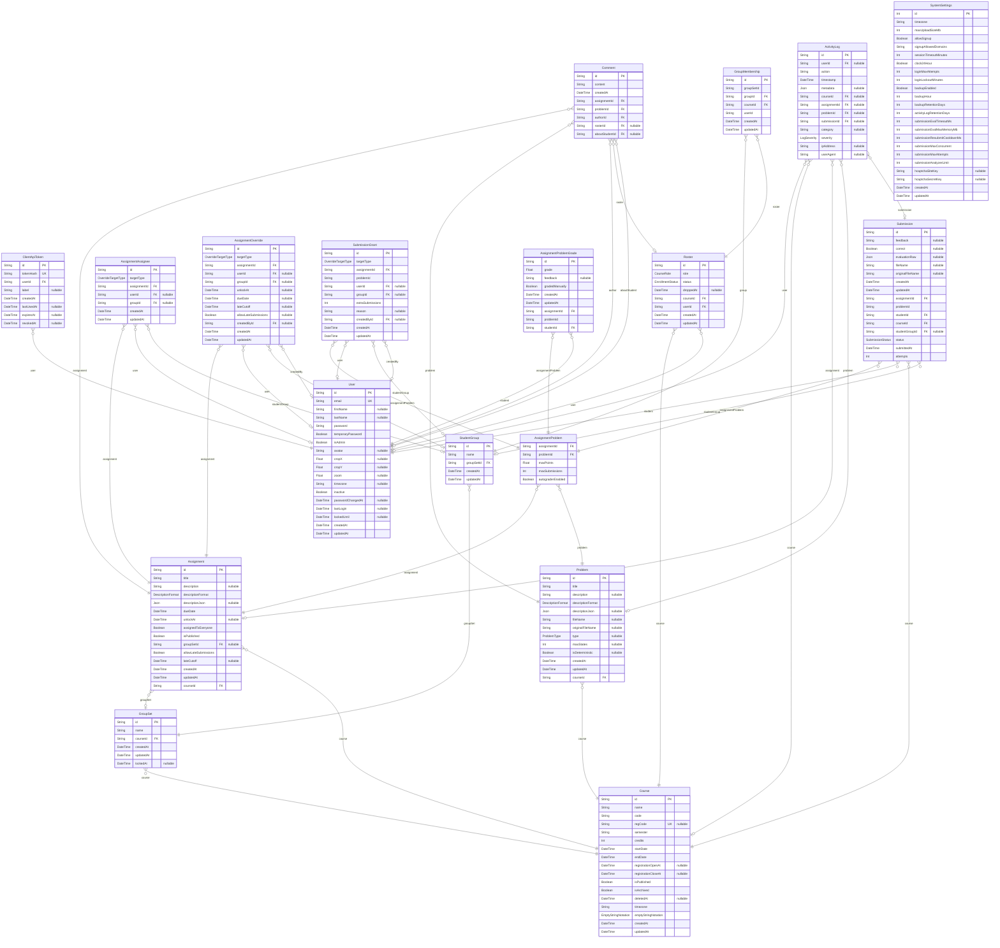

# Database schema

> Generated by [`prisma-markdown`](https://github.com/samchon/prisma-markdown)

- [default](#default)

## default

### `User`

Properties as follows:

- `id`:
- `email`:
- `firstName`:
- `lastName`:
- `password`:
- `temporaryPassword`:
- `isAdmin`:
- `avatar`:
- `cropX`:
- `cropY`:
- `zoom`:
- `timezone`:
- `inactive`:
- `passwordChangedAt`:
- `lastLogin`:
- `lockedUntil`:
- `createdAt`:
- `updatedAt`:

### `ClientApiToken`

Properties as follows:

- `id`:
- `tokenHash`:
- `userId`:
- `label`:
- `createdAt`:
- `lastUsedAt`:
- `expiresAt`:
- `revokedAt`:

### `Course`

Properties as follows:

- `id`:
- `name`:
- `code`:
- `regCode`:
- `semester`:
- `credits`:
- `startDate`:
- `endDate`:
- `registrationOpenAt`:
- `registrationCloseAt`:
- `isPublished`:
- `isArchived`:
- `deletedAt`:
- `timezone`:
- `emptyStringNotation`:
- `createdAt`:
- `updatedAt`:

### `Roster`

Properties as follows:

- `id`:
- `role`:
- `status`:
- `droppedAt`:
- `courseId`:
- `userId`:
- `createdAt`:
- `updatedAt`:

### `Assignment`

Properties as follows:

- `id`:
- `title`:
- `description`:
- `descriptionFormat`:
- `descriptionJson`:
- `dueDate`:
- `unlockAt`:
- `assignedToEveryone`:
- `isPublished`:
- `groupSetId`:
- `allowLateSubmissions`:
- `lateCutoff`:
- `createdAt`:
- `updatedAt`:
- `courseId`:

### `AssignmentAssignee`

Properties as follows:

- `id`:
- `targetType`:
- `assignmentId`:
- `userId`:
- `groupId`:
- `createdAt`:
- `updatedAt`:

### `AssignmentOverride`

Properties as follows:

- `id`:
- `targetType`:
- `assignmentId`:
- `userId`:
- `groupId`:
- `unlockAt`:
- `dueDate`:
- `lateCutoff`:
- `allowLateSubmissions`:
- `createdById`:
- `createdAt`:
- `updatedAt`:

### `Problem`

Properties as follows:

- `id`:
- `title`:
- `description`:
- `descriptionFormat`:
- `descriptionJson`:
- `fileName`:
- `originalFileName`:
- `type`:
- `maxStates`:
- `isDeterministic`:
- `createdAt`:
- `updatedAt`:
- `courseId`:

### `AssignmentProblem`

Properties as follows:

- `assignmentId`:
- `problemId`:
- `maxPoints`:
- `maxSubmissions`:
- `autograderEnabled`:

### `SubmissionGrant`

Properties as follows:

- `id`:
- `targetType`:
- `assignmentId`:
- `problemId`:
- `userId`:
- `groupId`:
- `extraSubmissions`:
- `reason`:
- `createdById`:
- `createdAt`:
- `updatedAt`:

### `GroupSet`

Properties as follows:

- `id`:
- `name`:
- `courseId`:
- `createdAt`:
- `updatedAt`:
- `lockedAt`:

### `StudentGroup`

Properties as follows:

- `id`:
- `name`:
- `groupSetId`:
- `createdAt`:
- `updatedAt`:

### `GroupMembership`

Properties as follows:

- `id`:
- `groupSetId`:
- `groupId`:
- `courseId`:
- `userId`:
- `createdAt`:
- `updatedAt`:

### `Submission`

Properties as follows:

- `id`:
- `feedback`:
- `correct`:
- `evaluationRaw`:
- `fileName`:
- `originalFileName`:
- `createdAt`:
- `updatedAt`:
- `assignmentId`:
- `problemId`:
- `studentId`:
- `courseId`:
- `studentGroupId`:
- `status`:
- `submittedAt`:
- `attempts`:

### `AssignmentProblemGrade`

Properties as follows:

- `id`:
- `grade`:
- `feedback`:
- `gradedManually`:
- `createdAt`:
- `updatedAt`:
- `assignmentId`:
- `problemId`:
- `studentId`:

### `Comment`

Properties as follows:

- `id`:
- `content`:
- `createdAt`:
- `assignmentId`:
- `problemId`:
- `authorId`:
- `rosterId`:
- `aboutStudentId`:

### `ActivityLog`

Properties as follows:

- `id`:
- `userId`:
- `action`:
- `timestamp`:
- `metadata`:
- `courseId`:
- `assignmentId`:
- `problemId`:
- `submissionId`:
- `category`:
- `severity`:
- `ipAddress`:
- `userAgent`:

### `SystemSettings`

Properties as follows:

- `id`: Singleton row (id=1)
- `timezone`:
- `maxUploadSizeMb`:
- `allowSignup`:
- `signupAllowedDomains`:
- `sessionTimeoutMinutes`:
- `clock24Hour`:
- `loginMaxAttempts`:
- `loginLockoutMinutes`:
- `backupEnabled`:
- `backupHour`:
- `backupRetentionDays`:
- `activityLogRetentionDays`:
- `submissionEvalTimeoutMs`:
- `submissionEvalMaxMemoryMb`:
- `submissionResubmitCooldownMs`:
- `submissionMaxConcurrent`:
- `submissionMaxAttempts`:
- `submissionAnalyzerLimit`:
- `hcaptchaSiteKey`:
- `hcaptchaSecretKey`:
- `createdAt`:
- `updatedAt`:
