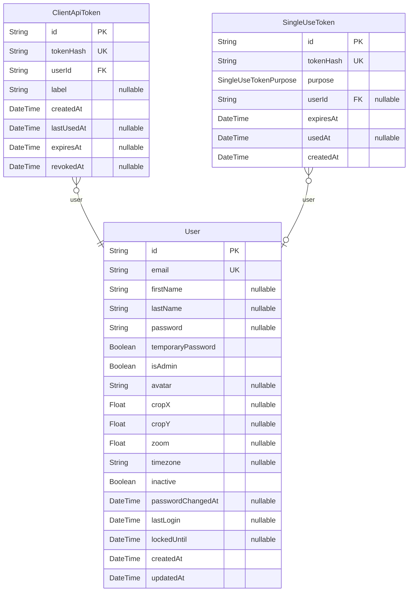
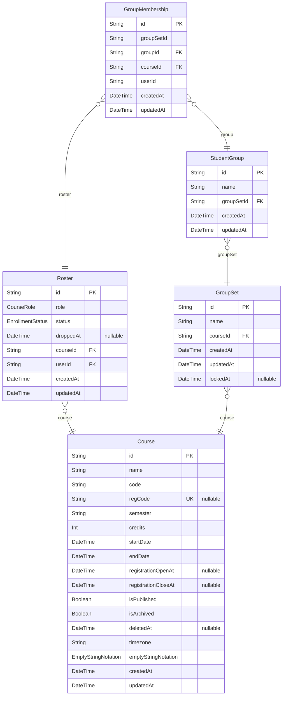
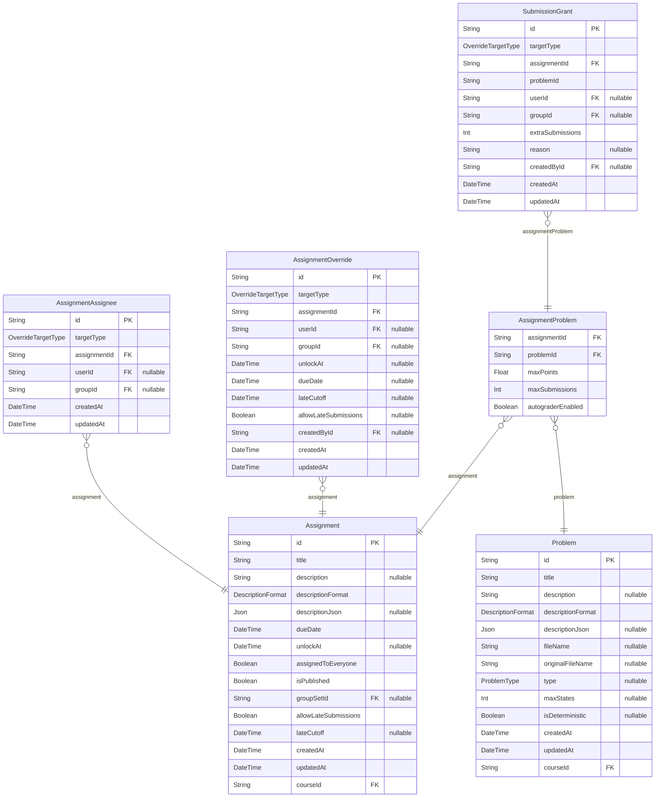
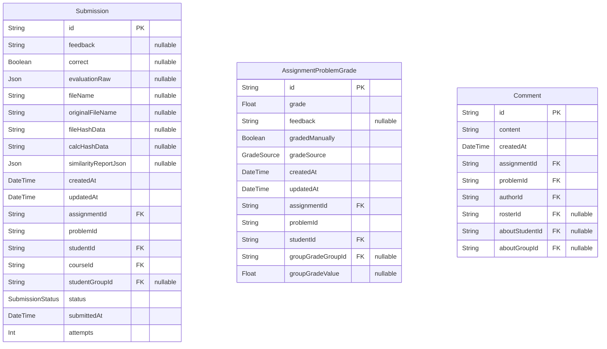
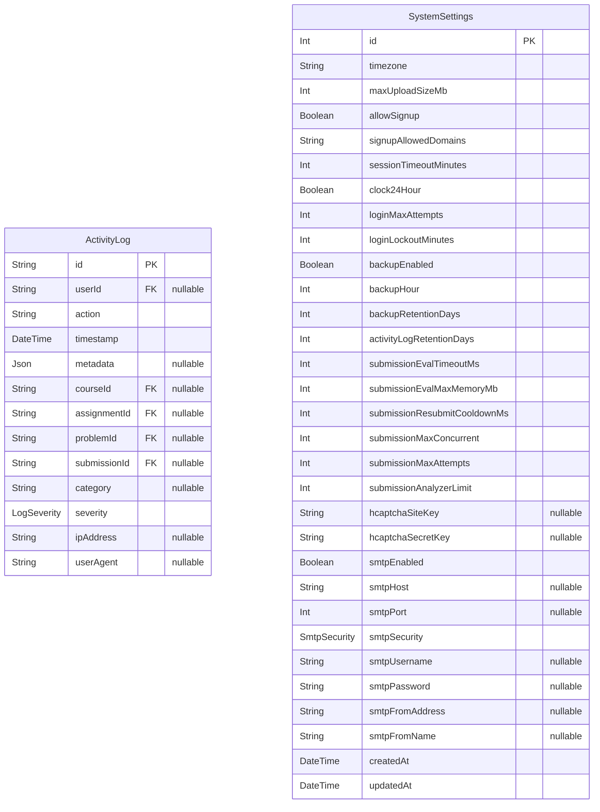

# Database schema

> Generated by [`prisma-markdown`](https://github.com/samchon/prisma-markdown)

- [Identity](#identity)
- [Courses](#courses)
- [Assignments](#assignments)
- [Submissions](#submissions)
- [System](#system)

## Identity

### `User`

A person with an account: student, teaching assistant, faculty member or system
administrator. One account is used across every course; what a person may do in a given
course comes from their Roster row, not from this record.

Properties as follows:

- `id`: Unique identifier.
- `email`: Sign-in address, and the identifier the institution's systems recognise.
- `firstName`: Given name.
- `lastName`: Family name.
- `password`
  > bcrypt hash of the local password, or null for an account that has none. The plain
  > password is never stored.
  >
  > Optional because an account will be able to exist without one: an identity provider or an
  > LMS launch can vouch for someone who never chose an AFCT password. Nothing creates such an
  > account yet, but every reader must already treat null as "cannot sign in with a password"
  > rather than assume a string is there.
- `temporaryPassword`: Whether the current password was issued by an administrator and must be changed at next sign-in.
- `isAdmin`
  > Whether this account administers the installation. What a person may do inside a particular
  > course comes from their Roster row instead; this is the only privilege that is global.
- `avatar`: Uploaded profile image, if any.
- `cropX`
  > How the avatar is framed. The uploaded image is stored unchanged and the framing is applied
  > when it is displayed, so re-cropping never needs a re-upload.
- `cropY`: Vertical framing of the avatar.
- `zoom`: Zoom level applied to the avatar.
- `timezone`: Preferred timezone for displaying times. Falls back to the installation default.
- `inactive`: Whether the account has been disabled. An inactive account cannot sign in but its records remain.
- `passwordChangedAt`
  > When the password was last changed. Sessions issued before this moment stop being accepted,
  > so a password reset ends any session an intruder already had rather than leaving it valid
  > until it expires.
- `lastLogin`
  > Last successful sign-in. Stored on the account rather than derived from the activity log, so
  > it survives log pruning.
- `lockedUntil`
  > When a temporary lockout ends, after too many failed sign-in attempts. The lock clears
  > itself once the time passes, and an administrator can lift it early. Empty means the account
  > is not locked.
- `createdAt`: When this record was created.
- `updatedAt`: When this record was last changed.

### `ClientApiToken`

Bearer token for the native submission client. The browser signs in with a session cookie;
the desktop client authenticates with one of these instead. Only a hash of the token is
stored, and the plaintext is shown once when it is issued. Tokens can be revoked and can
expire, so a lost machine or an outdated client can be cut off without changing the owner's
password.

Properties as follows:

- `id`: Unique identifier.
- `tokenHash`: Hash of the token. The token itself is shown once when issued and never stored.
- `userId`: The account the token acts as.
- `label`: Optional name for the token, so its owner can tell devices apart.
- `createdAt`: When this record was created.
- `lastUsedAt`: When the token was last used, so unused tokens can be spotted.
- `expiresAt`: When the token stops working. Empty means it does not expire on its own.
- `revokedAt`: When the token was withdrawn. Once set, the token is refused.

### `SingleUseToken`

A token that works exactly once, within a time window: the password-reset link today, and
the shape anything similar should reuse.

Only the SHA-256 hash is stored, so a leaked database, or a leaked backup, does not hand
anyone a working link. "Used exactly once" is enforced by a conditional update on `usedAt`
rather than by reading and then writing, so two simultaneous clicks on the same link cannot
both succeed.

Properties as follows:

- `id`: Unique identifier.
- `tokenHash`: sha256(token), never the plaintext.
- `purpose`: What the token authorises. A token issued for one purpose is refused for another.
- `userId`
  > Who the token is for. Optional because not every future purpose has a user behind it
  > (an LTI launch nonce, for instance, is issued before anyone is identified).
- `expiresAt`: When the token stops working.
- `usedAt`: When it was spent. Once set, the token is refused.
- `createdAt`: When this record was created.

## Courses

### `Course`

A single offering of a course: one section, in one term, with its own roster, assignments
and grades. Deadlines are anchored to the course timezone so a due date means the same
instant for everyone enrolled.

Properties as follows:

- `id`: Unique identifier.
- `name`: Course title as students see it.
- `code`: Course code, for example "CMPSC 464".
- `regCode`: Self-registration code students enter to join, if self-registration is offered.
- `semester`: Term the course runs in, for example "Fall 2026".
- `credits`: Credit hours.
- `startDate`: First day of the course.
- `endDate`: Last day of the course.
- `registrationOpenAt`: When self-registration opens. Empty means it is open as soon as the course is published.
- `registrationCloseAt`: When self-registration closes. Empty means it stays open.
- `isPublished`: Whether students can see the course. Unpublished courses are visible to staff only.
- `isArchived`: Whether the course has been retired. Archived courses are read-only.
- `deletedAt`
  > When the course was deleted. A deleted course is kept so it can be recovered, but is hidden
  > from everyone except administrators. A course must be archived before it can be deleted.
- `timezone`
  > The timezone that anchors this course's deadlines. Times entered by staff are interpreted
  > here, so a due date falls at the same moment for every student regardless of where they are.
- `emptyStringNotation`: Which symbol this course uses for the empty string when displaying automata and languages.
- `createdAt`: When this record was created.
- `updatedAt`: When this record was last changed.

### `Roster`

One person's place in one course. This is where a role lives: the same account can be a
student in one course and a teaching assistant in another. It also carries the student's
standing, so a student who drops keeps their record and can be restored.

Properties as follows:

- `id`: Unique identifier.
- `role`: What this person does in the course: student, teaching assistant or faculty.
- `status`
  > A student's standing in the course. Applies to students only; staff remain enrolled. A
  > student who drops loses access but keeps this record and all their work, so re-enrolling
  > restores everything.
- `droppedAt`: When the student dropped, if they did.
- `courseId`: The course.
- `userId`: The person.
- `createdAt`: When this record was created.
- `updatedAt`: When this record was last changed.

### `GroupSet`

A named way of dividing a course into groups, for example "Project teams" or "Lab partners".
A course can have several, and an assignment chooses at most one. Once work has been
submitted or graded against a set, its groups are frozen so that changing them cannot alter
records after the fact.

Properties as follows:

- `id`: Unique identifier.
- `name`: Name of the set, for example "Project teams".
- `courseId`: The course the set belongs to.
- `createdAt`: When this record was created.
- `updatedAt`: When this record was last changed.
- `lockedAt`
  > When this set's groups were frozen. Set automatically the first time work is submitted or
  > graded against an assignment using the set, and never cleared, so group changes cannot alter
  > records after the fact. Renaming and duplicating remain allowed.

### `StudentGroup`

One group inside a group set. Members submit and are graded together on any assignment that
uses the set.

Properties as follows:

- `id`: Unique identifier.
- `name`: Group name as members see it.
- `groupSetId`: The set this group belongs to.
- `createdAt`: When this record was created.
- `updatedAt`: When this record was last changed.

### `GroupMembership`

A student's place in one group. A student belongs to at most one group per set, so their
group is unambiguous for any assignment using it.

Properties as follows:

- `id`: Unique identifier.
- `groupSetId`: The set the group belongs to.
- `groupId`: The group joined.
- `courseId`: The course, carried here so membership can be checked per course.
- `userId`: The student.
- `createdAt`: When this record was created.
- `updatedAt`: When this record was last changed.

## Assignments

### `Assignment`

A piece of work given to a course, made up of one or more problems. It carries the dates
that apply to the class as a whole; exceptions for individual students or groups are
recorded separately as overrides. An assignment is a group assignment exactly when it names
a group set.

Properties as follows:

- `id`: Unique identifier.
- `title`: Assignment name as students see it.
- `description`: Instructions shown to students, as plain text.
- `descriptionFormat`: Whether the instructions are plain text or formatted.
- `descriptionJson`: Formatted instructions, when the assignment uses rich text.
- `dueDate`: When the work is due, in the course timezone.
- `unlockAt`
  > When the assignment becomes available to the class. Empty means it is available immediately.
  > Individual students or groups can be given a different date through an override.
- `assignedToEveryone`
  > Whether the assignment goes to the whole class. When false, it goes only to the students or
  > groups named as assignees.
- `isPublished`: Whether students can see the assignment.
- `groupSetId`: The group set used, when this is a group assignment. Empty means students work individually.
- `allowLateSubmissions`: Whether work is accepted after the due date. Off unless it is turned on.
- `lateCutoff`: Latest moment late work is still accepted. Empty means there is no cutoff.
- `createdAt`: When this record was created.
- `updatedAt`: When this record was last changed.
- `courseId`: The course this assignment belongs to.

### `AssignmentAssignee`

Who an assignment is for, when it is not for the whole class. Each row names one student or
one group. Rows carry no dates: changing who is assigned and changing someone's deadline are
separate concerns, so one never disturbs the other.

Properties as follows:

- `id`: Unique identifier.
- `targetType`: Whether this row names a student or a group.
- `assignmentId`: The assignment.
- `userId`: The assigned student, when the target is a student.
- `groupId`: The assigned group, when the target is a group.
- `createdAt`: When this record was created.
- `updatedAt`: When this record was last changed.

### `AssignmentOverride`

A date or late-policy exception for one student or one group on one assignment. This is only
ever about when, never about who. Any field left empty inherits the assignment's own value,
so an override can move a due date and leave the late policy alone.

Properties as follows:

- `id`: Unique identifier.
- `targetType`: Whether this exception applies to a student or a group.
- `assignmentId`: The assignment being excepted.
- `userId`: The student the exception is for, when the target is a student.
- `groupId`: The group the exception is for, when the target is a group.
- `unlockAt`: Replacement availability date. Empty inherits the assignment's.
- `dueDate`: Replacement due date. Empty inherits the assignment's.
- `lateCutoff`: Replacement late cutoff. Empty inherits the assignment's.
- `allowLateSubmissions`: Replacement late policy. Empty inherits the assignment's.
- `createdById`: The staff member who granted the exception.
- `createdAt`: When this record was created.
- `updatedAt`: When this record was last changed.

### `Problem`

A single exercise a student solves: a finite automaton, regular expression, grammar,
pushdown automaton or Turing machine. Problems belong to a course and can be reused across
its assignments.

Properties as follows:

- `id`: Unique identifier.
- `title`: Problem name as students see it.
- `description`: The problem statement, as plain text.
- `descriptionFormat`: Whether the statement is plain text or formatted.
- `descriptionJson`: Formatted statement, when the problem uses rich text.
- `fileName`: Stored reference solution file.
- `originalFileName`: Name of the reference file as uploaded, for display.
- `type`: What kind of problem this is: finite automaton, regular expression, grammar, pushdown automaton or Turing machine.
- `maxStates`: Largest number of states a solution may use. Empty means no limit.
- `isDeterministic`: Whether the solution must be deterministic.
- `createdAt`: When this record was created.
- `updatedAt`: When this record was last changed.
- `courseId`: The course this problem belongs to.

### `AssignmentProblem`

The appearance of one problem on one assignment, with the settings that apply there: how
much it is worth and how many attempts are allowed. The same problem can appear on more than
one assignment with different settings.

Properties as follows:

- `assignmentId`: The assignment.
- `problemId`: The problem appearing on it.
- `maxPoints`: What this problem is worth on this assignment.
- `maxSubmissions`: How many attempts a student gets. Zero or less means unlimited.
- `autograderEnabled`: Whether attempts are graded automatically.

### `SubmissionGrant`

Extra attempts given to one student or one group on one problem, over and above the limit
everyone else has. Recorded as its own entry rather than by raising the shared limit, so the
shared limit stays put and there is a lasting record of who granted what to whom.

Properties as follows:

- `id`: Unique identifier.
- `targetType`: Whether the extra attempts go to a student or a group.
- `assignmentId`: The assignment.
- `problemId`: The problem the extra attempts apply to.
- `userId`: The student receiving them, when the target is a student.
- `groupId`: The group receiving them, when the target is a group.
- `extraSubmissions`
  > How many additional attempts were granted. Always positive; granting again to the same
  > target adds to this number.
- `reason`: Why the extra attempts were granted, for the record.
- `createdById`: The staff member who granted them.
- `createdAt`: When this record was created.
- `updatedAt`: When this record was last changed.

## Submissions

### `Submission`

One attempt at one problem: the file the student sent, its progress through the grading
queue, and the result. Submissions are kept rather than replaced, so earlier attempts remain
available.

Properties as follows:

- `id`: Unique identifier.
- `feedback`: Feedback produced for this attempt.
- `correct`: Whether the attempt was judged correct. Empty until grading finishes.
- `evaluationRaw`: Full grader output, kept for diagnosis.
- `fileName`: Stored submitted file.
- `originalFileName`: Name of the file as the student sent it.
- `fileHashData`
  > Hash carried inside the uploaded file itself, written by the client that saved it.
  > Empty for a file that carries no such marker.
- `calcHashData`
  > Hash computed here from the file's own contents. Comparing the two shows whether the
  > file still matches what the client wrote.
- `similarityReportJson`
  > Similarity findings for this submission, used to spot the same file submitted more
  > than once.
- `createdAt`: When this record was created.
- `updatedAt`: When this record was last changed.
- `assignmentId`: The assignment.
- `problemId`: The problem attempted.
- `studentId`: The student who submitted.
- `courseId`: The course, carried here so a student's work can be found per course.
- `studentGroupId`: The group the work counts for, on a group assignment.
- `status`: Where the attempt is: waiting, being graded, finished or failed.
- `submittedAt`: When the student sent the attempt.
- `attempts`: How many times grading has been tried for this attempt.

### `AssignmentProblemGrade`

A student's grade on one problem of one assignment. A grade set by hand by a staff member is
marked as such, and automatic grading will not overwrite it.

Properties as follows:

- `id`: Unique identifier.
- `grade`: Points awarded.
- `feedback`: Comment recorded with the grade.
- `gradedManually`
  > Whether this grade is held against automatic grading. Re-running the grader skips a held
  > grade, so it cannot undo a person's decision.
  >
  > This is a hold, NOT a record of who graded. It starts true for every hand-entered grade,
  > but staff can release one (handing it back to the grader) or hold an autograded one, and
  > after either the flag says nothing about where the number came from. Use `gradeSource`
  > for that.
- `gradeSource`
  > Who produced the number: `AUTOGRADER` or `MANUAL`. Separate from the hold above because
  > the two come apart: a released manual grade is still a manual grade, and a held
  > autograded one is still the autograder's. Reading the hold as provenance told a grader
  > who had released their own grade that "the autograder set this grade".
  >
  > The three hand-grading routes write `MANUAL`; the submission worker writes `AUTOGRADER`,
  > including when it overwrites a released grade, because at that point the number is its
  > own. `lib/grade-hold.ts` is the only place that turns this into words for a screen.
- `createdAt`: When this record was created.
- `updatedAt`: When this record was last changed.
- `assignmentId`: The assignment.
- `problemId`: The problem graded.
- `studentId`: The student graded.
- `groupGradeGroupId`: The group whose group grade produced this row, when it came from one.
- `groupGradeValue`
  > The value that group grade set, so a later individual change reads as an adjustment.
  > Outlives the group: deleting one nulls the id above but keeps this, so "adjusted away
  > from 8" stays true afterwards.

### `Comment`

Feedback attached to a student's work, written by staff or by the student.

Properties as follows:

- `id`: Unique identifier.
- `content`: The comment text.
- `createdAt`: When this record was created.
- `assignmentId`: The assignment the comment is about.
- `problemId`: The problem the comment is about.
- `authorId`: Who wrote it.
- `rosterId`: The commenter's place in the course, recording the role they wrote in.
- `aboutStudentId`: The student the comment concerns, when staff comment on someone's work.
- `aboutGroupId`: The group the comment concerns, when staff comment on a group's shared work.

## System

### `ActivityLog`

The record of what happened in the system: who signed in, who changed a grade, who looked at
a student's work, and when. It serves both as an audit trail and, because AFCT is used in a
multi-institution study, as research data. Entries are kept for a configurable period and
then removed.

Properties as follows:

- `id`: Unique identifier.
- `userId`: Who performed the action. Empty for actions with no signed-in person, such as a failed sign-in.
- `action`: What happened.
- `timestamp`: When it happened.
- `metadata`: Extra detail about the action.
- `courseId`: The course involved, if any.
- `assignmentId`: The assignment involved, if any.
- `problemId`: The problem involved, if any.
- `submissionId`: The submission involved, if any.
- `category`: Broad grouping the action falls under.
- `severity`: How significant the entry is.
- `ipAddress`: Address the request came from.
- `userAgent`: Client that made the request.

### `SystemSettings`

Installation-wide settings, held as a single row: the default timezone, sign-up rules,
upload and login limits, backup schedule, and grading queue tuning.

Properties as follows:

- `id`: Always 1. Settings are held in a single row.
- `timezone`: Default timezone for the installation. New courses start with this.
- `maxUploadSizeMb`: Largest file a student may upload, in megabytes.
- `allowSignup`: Whether people may create their own accounts. When off, only an administrator can add users.
- `signupAllowedDomains`
  > Comma-separated list of email domains allowed to self-register, for example
  > "psu.edu,example.edu". Blank allows any domain.
- `sessionTimeoutMinutes`: How long a session may sit idle before the person is signed out.
- `clock24Hour`
  > Whether times are shown on a 24-hour clock rather than with AM and PM. Affects display only,
  > never stored times or deadline enforcement.
- `loginMaxAttempts`: How many failed sign-in attempts an account may accumulate before it is temporarily locked.
- `loginLockoutMinutes`: How long an account stays locked after too many failed sign-in attempts.
- `backupEnabled`: Whether the nightly database backup runs.
- `backupHour`: Hour of the day, in UTC, at which the nightly backup runs.
- `backupRetentionDays`: How many days of backups to keep before the oldest are removed.
- `activityLogRetentionDays`: How long activity log entries are kept before they are removed.
- `submissionEvalTimeoutMs`: How long a single submission may be graded before it is abandoned, in milliseconds.
- `submissionEvalMaxMemoryMb`: Memory ceiling for grading one submission, in megabytes.
- `submissionResubmitCooldownMs`: How long a student must wait between attempts at the same problem, in milliseconds.
- `submissionMaxConcurrent`: How many submissions may be graded at the same time.
- `submissionMaxAttempts`: How many times grading is retried before a submission is reported as failed.
- `submissionAnalyzerLimit`: Exploration bound given to the grammar analyzer when comparing languages.
- `hcaptchaSiteKey`
  > Public hCaptcha key used on the sign-in page. Empty falls back to the value supplied by the
  > environment, and then to having no captcha.
- `hcaptchaSecretKey`: Private hCaptcha key. Never sent to the browser.
- `smtpEnabled`
  > Whether AFCT may send email at all. Off until an admin configures a server and turns it
  > on, so an install that does not want mail behaves exactly as it did before.
- `smtpHost`: Mail server hostname.
- `smtpPort`: Mail server port. 587 with STARTTLS is the usual institutional answer.
- `smtpSecurity`:
- `smtpUsername`: Username for the mail server, when it requires one.
- `smtpPassword`
  > Password for the mail server. Encrypted at rest (see `lib/secret-encryption`) and never
  > returned to the browser; the API reports only whether one is stored.
- `smtpFromAddress`: Address mail is sent from. Institutions usually require this to be one they host.
- `smtpFromName`: Display name shown beside the from address.
- `createdAt`: When this record was created.
- `updatedAt`: When this record was last changed.
