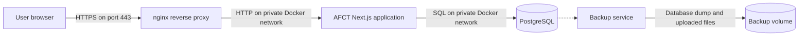
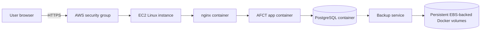
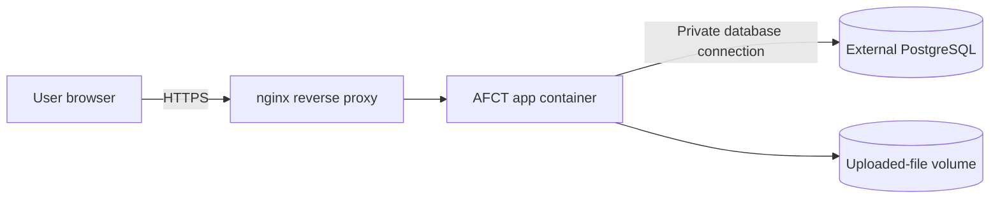

# Deployment architecture

AFCT runs as a Docker Compose application. The supported production stack contains four services: nginx, the AFCT application, PostgreSQL, and the backup service.

## Service responsibilities

| Service | Responsibility |
|---|---|
| `afct-nginx` | Terminates TLS, redirects HTTP to HTTPS, and forwards requests to the application |
| `afct-app` | Runs the Next.js interface, API routes, authentication, and evaluator integration |
| `afct-postgres` | Stores application data |
| `afct-db-backup` | Creates scheduled database and uploaded-file backups |

nginx is the only public-facing service. It listens on ports 80 and 443.

The application and PostgreSQL communicate through the private Docker network. PostgreSQL does not expose a public port. Use `docker exec` for database maintenance instead of publishing the database port.

## Persistent data

Containers are replaceable. Named volumes store:

- PostgreSQL data
- Uploaded files
- Backup archives
- TLS certificates

Stopping or recreating a container does not remove its named volumes.

Commands that include `--volumes`, `-v`, or `docker volume rm` can permanently delete data. Read the command carefully before running it.

## AWS EC2 deployment

On AWS, the recommended deployment keeps the same Docker Compose architecture on one EC2 instance:

The EC2 security group should allow only the public web traffic AFCT needs and SSH access for administrators. PostgreSQL should remain private.

## Optional external PostgreSQL

Some deployments may use an external PostgreSQL service, such as Amazon RDS for PostgreSQL, instead of the bundled PostgreSQL container.

That architecture looks like this:

Use this only when the deployment administrator is prepared to manage the external database connection, network rules, backups, and restore process. The standard AFCT backup container is designed for the bundled PostgreSQL service.

## Security boundaries

The production configuration follows these boundaries:

- Only nginx accepts public traffic
- PostgreSQL remains private
- The application is not directly exposed
- Secrets are supplied through `.env.production`
- The environment file is restricted to the deployment administrator
- Persistent data remains available when containers are replaced
