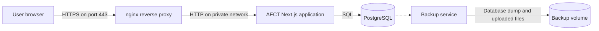

# Deployment architecture

AFCT runs as four Docker Compose services.

## Service responsibilities

| Service | Responsibility |
|---|---|
| `afct-nginx` | Terminates TLS, redirects HTTP to HTTPS, and forwards requests |
| `afct-app` | Runs the Next.js interface and API routes |
| `afct-postgres` | Stores application data |
| `afct-db-backup` | Creates scheduled database and uploaded-file backups |

nginx is the only public-facing service. It listens on ports 80 and 443.

The application and PostgreSQL communicate through the private Docker network. PostgreSQL does not expose a public port. Use `docker exec` for database maintenance instead of publishing the database port.

## Persistent data

Containers are replaceable. Named volumes store:

- PostgreSQL data
- Uploaded files
- Backup archives
- TLS certificates

Stopping or recreating a container does not remove its named volumes.

Commands that include `--volumes`, `-v`, or `docker volume rm` can permanently delete data. Read the command carefully before running it.

## Security boundaries

The production configuration follows these boundaries:

- Only nginx accepts public traffic
- PostgreSQL remains inside the Docker network
- The application is not directly exposed
- Secrets are supplied through `.env.production`
- The environment file is restricted to the deployment administrator
- Persistent data remains available when containers are replaced
