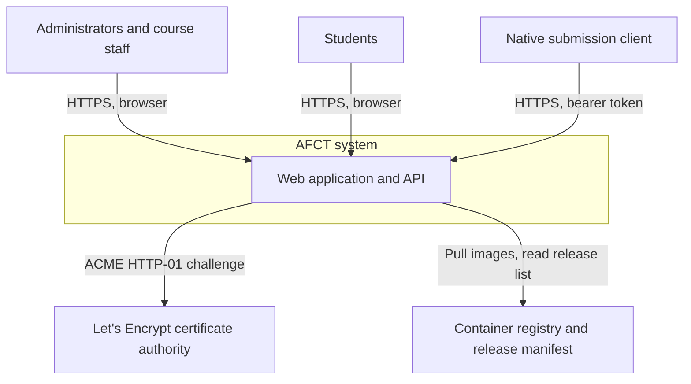
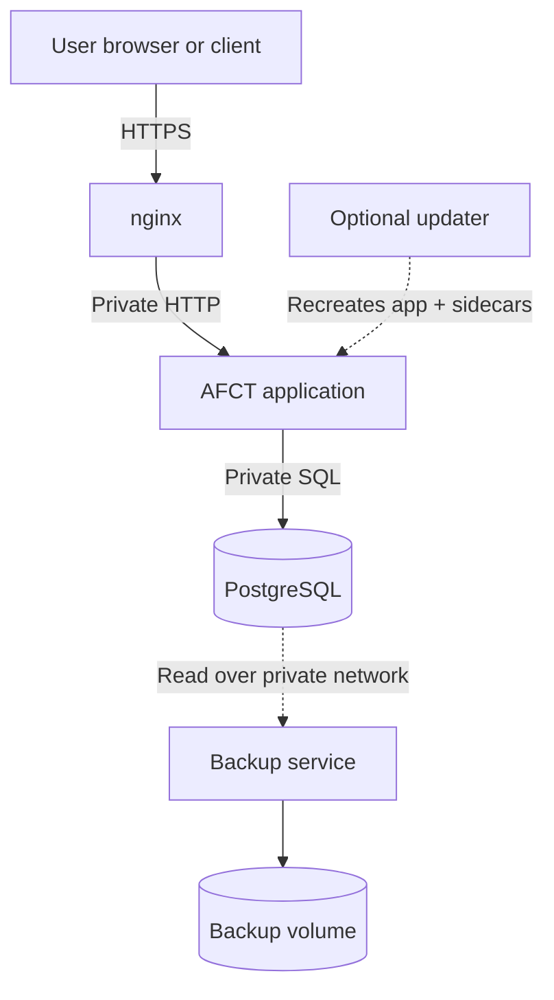
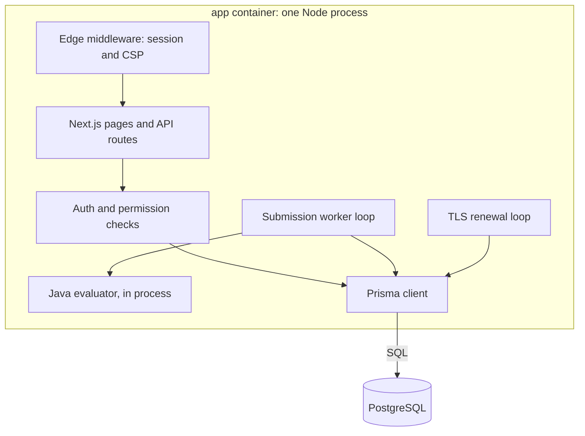
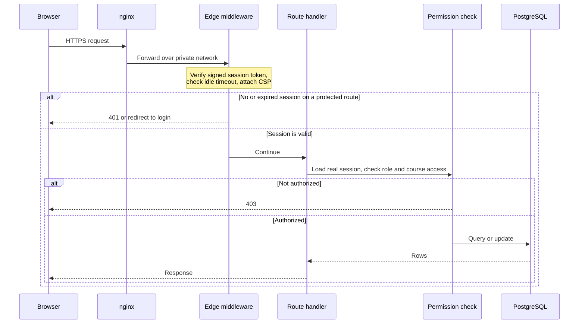
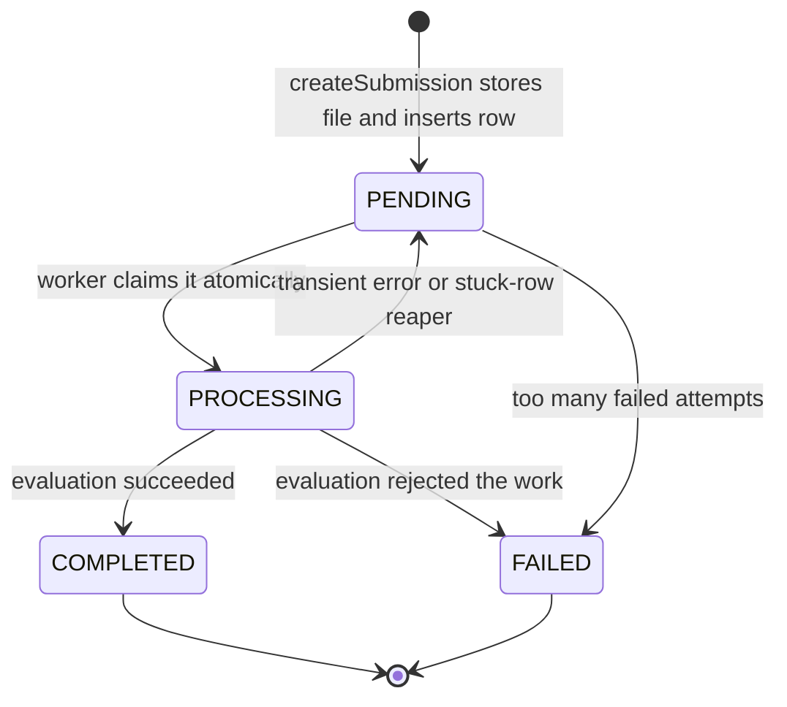
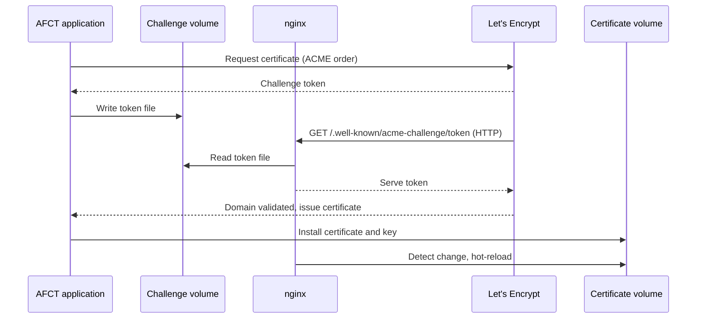
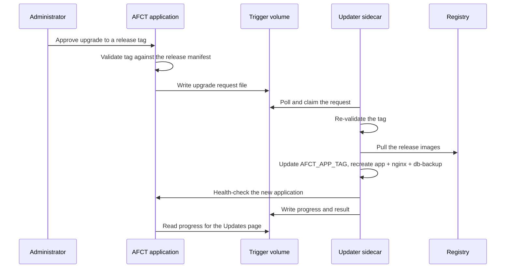
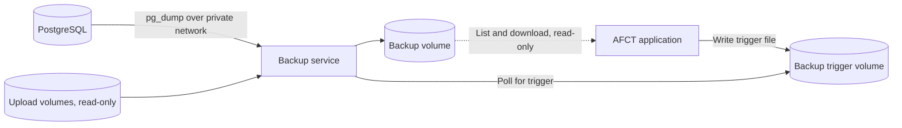

# System Architecture

AFCT runs as a Docker Compose application. The supported production stack has four core
services: nginx, the AFCT application, PostgreSQL, and the backup service. An optional
updater service can be enabled for browser-based upgrades.

This document describes the architecture at several levels of detail, from a high-level
context view down to individual request and processing flows. Read the level you need:

1. [System context](#system-context) is who talks to AFCT and what AFCT talks to.
2. [Deployment view](#deployment-view) is the running container stack.
3. [Inside the application container](#inside-the-application-container) is what runs in the
   one application process.
4. The flow sections ([requests](#request-lifecycle), [submissions](#submission-processing),
   [certificates](#tls-certificate-issuance-and-renewal), [upgrades](#in-app-upgrades)) trace
   a single operation end to end.

## System context

At the highest level, AFCT is one system that a few kinds of user reach over HTTPS, plus a
small number of outside services it depends on.

- **Browsers** reach the dashboard and API over HTTPS. Sessions use a signed cookie.
- The **native submission client** uses the versioned `/api/client` surface with a bearer
  token instead of a browser session. See [Client API](client-api.md).
- **Let's Encrypt** issues and renews the public TLS certificate. AFCT talks to it directly.
- The **container registry** (GHCR) holds the release images, and a curated manifest lists
  the versions an install may upgrade to. See [Creating a release](creating-a-release.md).

## Deployment view

The running system is a set of containers on one Docker network. Only nginx is exposed to
the public internet.

### Service responsibilities

| Compose service | Container        | Responsibility                                                                                                                        |
| --------------- | ---------------- | ------------------------------------------------------------------------------------------------------------------------------------- |
| `nginx`         | `afct-nginx`     | Terminates TLS, serves Let's Encrypt HTTP challenges, redirects other HTTP traffic to HTTPS, and forwards requests to the application |
| `app`           | `afct-app`       | Runs the Next.js interface, API routes, authentication, submission worker, evaluator integration, and Let's Encrypt issuance and renewal |
| `postgres`      | `afct-postgres`  | Stores application data                                                                                                               |
| `db-backup`     | `afct-db-backup` | Creates scheduled and on-demand database and uploaded-file backups                                                                    |
| `updater`       | `afct-updater`   | Optional privileged helper for approved in-app upgrades and downgrades                                                                |

nginx is the only service with published network ports. It listens on ports 80 and 443. The
application uses an internal port on the private Compose network, and PostgreSQL does not
publish a host port.

Use `docker exec` or another controlled administrative path for database maintenance. Do not
expose PostgreSQL to the public internet.

## Inside the application container

The `app` service is a single Node.js process. Several responsibilities that might be
separate services in other systems run **inside that one process** in AFCT: the web and API
handlers, the edge middleware, the background submission worker, and the certificate-renewal
loop. This keeps the deployment small, and it is why the application container, not a
separate service, is the one that renews certificates and evaluates submissions.

The web handlers respond to requests. The worker and renewal loops are started once at
process startup and run on their own schedule, independent of any request. All of them read
and write the same database through Prisma.

## Request lifecycle

An authenticated request passes through two layers of protection before it reaches the
database: a fast edge check that runs on every request, and an authoritative check in the
route handler itself.

The **edge middleware** is a coarse net. It reads the signed session token without touching
the database, enforces the idle-session timeout, and applies the Content-Security-Policy. A
short allowlist of public API paths (authentication, health, public settings, and the whole
native-client API) skips the session requirement.

The **route handler** does the real authorization. Standard wrappers load the full session
and check the caller against the permission helpers (global administrator, or the caller's
role on the specific course) before any data is read or written. The edge check speeds up the
common rejection; the handler check is the one that actually protects the data.

## Submission processing

A submission is created by a request but graded by the background worker, so the two are
decoupled through the database. The submission row moves through a small set of states.

`createSubmission` is the shared path for both the browser route and the native-client route.
It checks authorization, the per-problem attempt cap, the resubmission cooldown, the
availability and late window, and the uploaded file, stores the file, then inserts the row as
`PENDING` inside a serializable transaction that re-checks the cap.

The **worker** is the background loop inside the application process. It claims a pending row
with a single conditional update (set to `PROCESSING` only if still `PENDING`), which makes
the claim safe even when several worker loops run at once: exactly one wins. It runs the Java
evaluator in the same process, then writes the result back as `COMPLETED` or `FAILED`. A row
left in `PROCESSING` too long is returned to `PENDING` by a periodic reaper so it can be
retried, and a row that keeps failing is moved to `FAILED` so it cannot loop forever. On a
completed autograded submission, grades are written without overwriting a manual grade.

## TLS certificate issuance and renewal

The application container obtains and renews the Let's Encrypt certificate itself. nginx only
serves the challenge file and reloads when a new certificate appears. The two share two
volumes: one for the challenge files, one for the certificates.

Issuance uses the ACME HTTP-01 challenge. nginx serves the challenge path over plain HTTP so
the authority can confirm domain control; everything else is redirected to HTTPS. A renewal
loop in the application runs shortly after startup and then daily, reissuing only when the
installed certificate is near expiry. The existing certificate stays in place unless a new
one is issued successfully.

## In-app upgrades

The application never controls Docker. An approved in-app upgrade is a request the
application writes to a shared volume and the privileged updater sidecar carries out.

The updater lives in an off-by-default Compose profile, holds the Docker socket, and mounts
the deployment directory. It re-validates the requested tag against the curated release
manifest before doing anything. An in-app upgrade recreates the `app`, `nginx`, and
`db-backup` services together at the selected release tag. Two services are intentionally left
out: `postgres` is pinned by digest, not the release tag, and the `updater` cannot recreate
its own running container, so a new updater image is picked up on the next host-side
`sh install.sh update`. See the [updater boundary](#optional-updater-boundary) below for the
security rationale, and [Updates](updates.md) for the operator's view.

## Persistent data

Named volumes retain:

- PostgreSQL data
- Public and private uploaded files
- Backup archives
- Active and self-signed TLS certificates
- Backup and update request files

The application and nginx also share a volume for temporary Let's Encrypt HTTP challenge
files. nginx serves only that challenge path over plain HTTP so the certificate authority can
confirm domain control.

Replacing a container does not remove these volumes. Commands that include `--volumes`, `-v`,
or `docker volume rm` can permanently delete data.

## Backup flow

The backup service reads PostgreSQL over the private network and mounts both upload volumes
read-only. Each successful run writes a custom-format PostgreSQL dump and, when uploads exist,
a matching archive of the upload volumes.

The application can list and download backup files. It requests a new backup by writing a
trigger file. It does not receive database credentials for a browser-driven general restore.

During an approved downgrade, the updater stops the application and asks the backup service to
restore the selected database restore point. Uploaded files are not rolled back by that
downgrade, so files created later can remain as unreferenced data.

## Optional updater boundary

The updater is in the `updater` Compose profile and is off by default. It mounts the Docker
socket and the deployment directory so it can pull the approved images, change `AFCT_APP_TAG`,
and recreate the affected services.

Treat access to the updater container as host-level administrative access. The main
application never mounts the Docker socket. It can only write a structured request to the
shared update trigger volume.

## AWS EC2 deployment

The documented AWS path keeps the Compose stack on one EC2 instance. The instance's security
group should allow the required web traffic and tightly restricted administrator access.
PostgreSQL stays on the private Docker network, and Docker volumes live on the instance's
attached storage.

A backup kept only on that instance does not protect against loss of the instance or its
disk. Copy backup pairs to protected off-host storage.

## External PostgreSQL is a customization

The standard Compose file always starts and waits for its bundled `postgres` service, and the
standard backup service is configured for that database. Using Amazon RDS or another external
PostgreSQL service requires changes to the Compose dependencies, database environment, network
rules, migrations, backups, and restore plan.

That layout can be built by an experienced deployment team, but it is not the out-of-the-box
AFCT deployment path.

## Security boundaries

- Only nginx accepts public traffic.
- PostgreSQL stays on a private network.
- The application container does not control Docker.
- The optional updater does control Docker and stays disabled unless deliberately enabled.
- Every state-changing request is authorized in the route handler, not only at the edge.
- Secrets are supplied through `.env.production`, which should be readable only by the
  deployment administrator.
- Uploaded files, database data, certificates, and backups live in persistent volumes.
