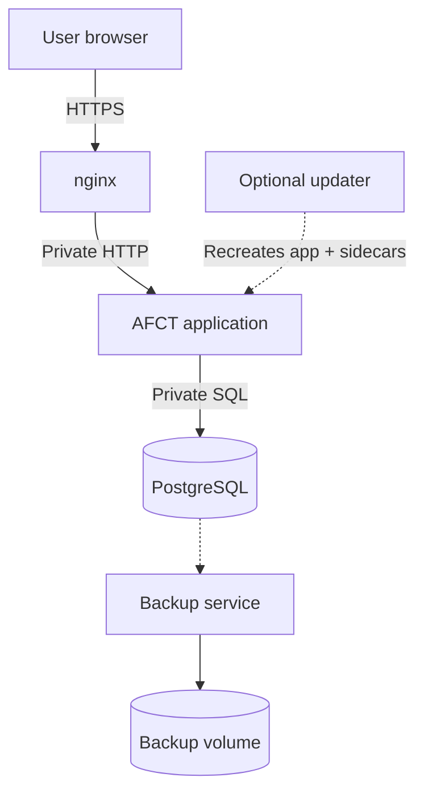

# System Architecture

AFCT runs as a Docker Compose application. The supported production stack has four core services: nginx, the AFCT application, PostgreSQL, and the backup service. An optional updater service can be enabled for browser-based upgrades.

## Service responsibilities

| Compose service | Container        | Responsibility                                                                                                                        |
| --------------- | ---------------- | ------------------------------------------------------------------------------------------------------------------------------------- |
| `nginx`         | `afct-nginx`     | Terminates TLS, serves Let's Encrypt HTTP challenges, redirects other HTTP traffic to HTTPS, and forwards requests to the application |
| `app`           | `afct-app`       | Runs the Next.js interface, API routes, authentication, submission worker, evaluator integration, and Let's Encrypt issuance and renewal |
| `postgres`      | `afct-postgres`  | Stores application data                                                                                                               |
| `db-backup`     | `afct-db-backup` | Creates scheduled and on-demand database and uploaded-file backups                                                                    |
| `updater`       | `afct-updater`   | Optional privileged helper for approved in-app upgrades and downgrades                                                                |

nginx is the only service with published network ports. It listens on ports 80 and 443. The application uses an internal port on the private Compose network, and PostgreSQL does not publish a host port.

Use `docker exec` or another controlled administrative path for database maintenance. Do not expose PostgreSQL to the public internet.

## Persistent data

Named volumes retain:

- PostgreSQL data
- Public and private uploaded files
- Backup archives
- Active and self-signed TLS certificates
- Backup and update request files

The application and nginx also share a volume for temporary Let's Encrypt HTTP challenge files. nginx serves only that challenge path over plain HTTP so the certificate authority can confirm domain control.

Replacing a container does not remove these volumes. Commands that include `--volumes`, `-v`, or `docker volume rm` can permanently delete data.

## Backup flow

The backup service reads PostgreSQL over the private network and mounts both upload volumes read-only. Each successful run writes a custom-format PostgreSQL dump and, when uploads exist, a matching archive of the upload volumes.

The application can list and download backup files. It requests a new backup by writing a trigger file. It does not receive database credentials for a browser-driven general restore.

During an approved downgrade, the updater stops the application and asks the backup service to restore the selected database restore point. Uploaded files are not rolled back by that downgrade, so files created later can remain as unreferenced data.

## Optional updater boundary

The updater is in the `updater` Compose profile and is off by default. It mounts the Docker socket and the deployment directory so it can pull the approved images, change `AFCT_APP_TAG`, and recreate the affected services.

Treat access to the updater container as host-level administrative access. The main application never mounts the Docker socket. It can only write a structured request to the shared update trigger volume.

An in-app upgrade recreates the `app`, `nginx`, and `db-backup` services together at the selected release tag. Two services are intentionally left out: `postgres` is pinned by digest (not the release tag), and the `updater` cannot recreate its own running container. The new `updater` image is therefore picked up on the next host-side `sh install.sh update`, which a release flags when the updater or the Compose file changed.

## AWS EC2 deployment

The documented AWS path keeps the Compose stack on one EC2 instance. The instance's security group should allow the required web traffic and tightly restricted administrator access. PostgreSQL stays on the private Docker network, and Docker volumes live on the instance's attached storage.

A backup kept only on that instance does not protect against loss of the instance or its disk. Copy backup pairs to protected off-host storage.

## External PostgreSQL is a customization

The standard Compose file always starts and waits for its bundled `postgres` service, and the standard backup service is configured for that database. Using Amazon RDS or another external PostgreSQL service requires changes to the Compose dependencies, database environment, network rules, migrations, backups, and restore plan.

That layout can be built by an experienced deployment team, but it is not the out-of-the-box AFCT deployment path.

## Security boundaries

- Only nginx accepts public traffic.
- PostgreSQL stays on a private network.
- The application container does not control Docker.
- The optional updater does control Docker and stays disabled unless deliberately enabled.
- Secrets are supplied through `.env.production`, which should be readable only by the deployment administrator.
- Uploaded files, database data, certificates, and backups live in persistent volumes.
