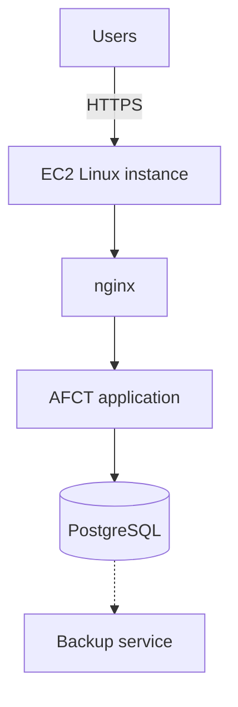

# AFCT on AWS EC2

These instructions describe the recommended AWS production path: one EC2 instance running Linux and the standard AFCT Docker Compose stack.

Use this guide when you want to host the production AFCT site on AWS. If you already have a Linux server outside AWS, use the [Linux deployment guide](linux.md) instead.

## Recommended architecture

The standard AWS deployment is:



This keeps the deployment close to the normal AFCT installer workflow. The EC2 instance behaves like a regular Linux server, so updates, backups, logs, TLS, and diagnostics use the same commands as the Linux guide.

## When to use RDS

The default and simplest AWS deployment keeps PostgreSQL in the Docker Compose stack.

Use Amazon RDS for PostgreSQL only if you are comfortable maintaining a custom deployment. The standard Compose file starts a bundled PostgreSQL service, waits for it during application startup, and points the backup service at it. Setting `DATABASE_URL` alone does not replace that architecture.

An RDS deployment needs Compose changes for service dependencies and database environment values, private network access from EC2, a migration plan, and an RDS-native backup and restore process. Keep RDS private and allow database traffic only from the AFCT host. This path is not covered by the guided installer.

## Prerequisites

Before starting, you need:

- An AWS account
- Permission to create EC2 instances, security groups, storage, and DNS records
- A DNS name for the AFCT site, such as `afct.example.edu`
- An SSH key pair for connecting to the instance

Review the [system requirements](../requirements.md) before choosing an instance size.

## Create the EC2 instance

Create a Linux EC2 instance. Ubuntu LTS and Amazon Linux 2023 both work; the [Linux deployment guide](linux.md) lists the commands for each.

Recommended starting size:

- 2 or more vCPUs
- 8 GB of RAM
- 40 GB or more of EBS storage

Small test deployments can use less, but production systems should leave room for uploaded files, database growth, backups, and operating-system updates.

## Configure the security group

Create or update the instance security group with these inbound rules:

| Port | Source                             | Purpose                |
| ---- | ---------------------------------- | ---------------------- |
| 22   | Your administrator IP address only | SSH administration     |
| 80   | Anywhere users need access         | HTTP redirect to HTTPS |
| 443  | Anywhere users need access         | AFCT over HTTPS        |

Do not open PostgreSQL to the public internet. In the standard Docker Compose deployment, PostgreSQL is private to the Docker network and does not need a public security-group rule.

## Configure DNS

Create a DNS record for the public AFCT hostname and point it to the EC2 instance.

Use a stable address, such as an Elastic IP or another DNS setup that will not change when the instance restarts.

The final public URL should look like:

```text
https://afct.example.edu
```

This exact URL is used for `NEXTAUTH_URL`. Do not use HTTP, an IP address, an extra path, or an unnecessary port.

## Connect to the instance

Connect with SSH. The default user is `ubuntu` on Ubuntu AMIs and `ec2-user` on Amazon Linux:

```bash
ssh ubuntu@afct.example.edu      # Ubuntu
ssh ec2-user@afct.example.edu    # Amazon Linux
```

If your DNS record is not ready yet, connect with the EC2 public DNS name or public IP address. Still use the final HTTPS hostname when the installer asks for the public AFCT URL.

## Install AFCT

After connecting to the EC2 instance, follow the [Linux deployment guide](linux.md).

Use the guided installer unless you have a reason to customize the Docker Compose setup.

The installer will:

- Check Docker and the Compose plugin
- Collect the public AFCT URL
- Collect or generate the initial administrator password
- Generate required secrets
- Create `.env.production`
- Pull the container images
- Start the AFCT stack

## Verify the deployment

After installation, check the services:

```bash
docker compose ps
```

Then open the public URL in a browser and confirm that:

- The site loads over HTTPS
- The login page appears
- The initial administrator can sign in
- The administration pages open

A certificate warning is expected until you replace the default self-signed certificate.

## Backups and storage

Use the AFCT backup tools described in [Backups and recovery](../../operations/backups.md). Also consider AWS-level protection for the EC2 instance storage, such as regular EBS snapshots.

Do not delete Docker volumes unless you intentionally want to delete AFCT data.

## Updates and operations

Run these commands from the directory that contains `docker-compose.yml`:

```bash
sh install.sh status
sh install.sh logs
sh install.sh doctor
sh install.sh update
sh install.sh restart
sh install.sh diagnostics
```

Continue with [TLS certificates](../../admin/system-settings.md#tls-certificate), [updates](../../operations/updates.md), [backups](../../operations/backups.md), and [troubleshooting](../../operations/troubleshooting.md).

## Other AWS hosting options

EC2 is the recommended AWS option for AFCT because it matches the supported Docker Compose deployment.

Other AWS services are possible, but they are not the default documentation path:

- **App Runner** is better for stateless web containers. AFCT also needs PostgreSQL, uploads, backups, and operational commands.
- **ECS or Fargate** can run AFCT, but it requires more AWS-specific setup for networking, storage, secrets, load balancing, and database management.
- **Elastic Beanstalk** can run Docker applications, but it adds another deployment model that is harder to support than the standard installer.
- **S3 and CloudFront** are useful for static documentation sites, not the AFCT production application.
