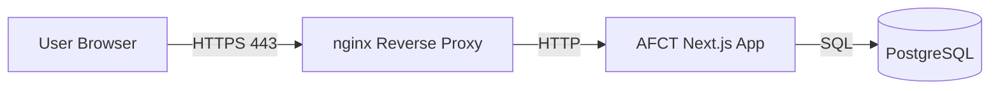
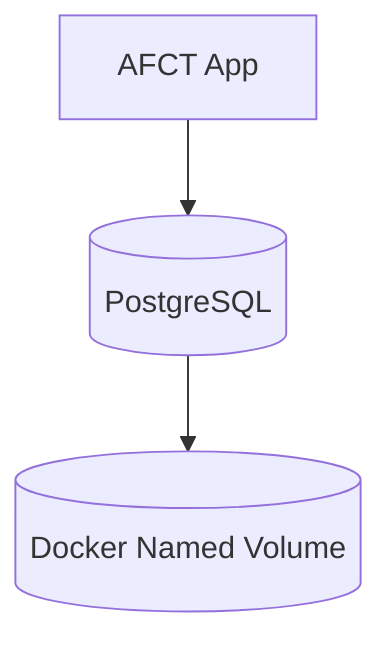

# AFCT — Production Deployment Guide

This guide describes how to deploy **AFCT** in a **production environment** on **Windows, macOS, or Linux**.

> **Docker is the preferred and fully supported deployment method.**
> Non-Docker setups are possible but **not recommended** and are not officially supported.

---

## Table of Contents

1. [Prerequisites](#1-prerequisites)
2. [Install Docker](#2-install-docker)
3. [Get the Code](#3-get-the-code)
4. [Configure Production Environment](#4-configure-production-environment)
5. [TLS / HTTPS Certificates](#5-tls--https-certificates)
6. [Architecture Overview](#6-architecture-overview)
7. [Start the Stack](#7-start-the-stack)
8. [Verify Deployment](#8-verify-deployment)
9. [Updating AFCT](#9-updating-afct)
10. [Backups](#10-backups)
11. [Troubleshooting](#11-troubleshooting)
12. [Optional: Non-Docker Setup (Not Recommended)](#optional-non-docker-setup-not-recommended)

---

## 1) Prerequisites

Before you begin, make sure you have:

- A server or host with **at least 2 CPU cores and 4 GB RAM**
- A **public DNS record** pointing your domain to the server’s IP
- Firewall ports **80 (HTTP)** and **443 (HTTPS)** open
- `git` installed

> AFCT uses **Docker named volumes** for persistence.
> No host directories are required.

---

## 2) Install Docker

### Windows (Windows Server 2022 or Windows 11)

1. Install **Docker Desktop** and enable **WSL 2**
   [https://docs.docker.com/desktop/install/windows-install/](https://docs.docker.com/desktop/install/windows-install/)
2. During installation, ensure:
   - ✅ _Use WSL 2 instead of Hyper-V_

3. Verify installation in PowerShell:

```powershell
wsl --status
docker --version
docker compose version
```

---

### macOS (Apple Silicon or Intel)

1. Install **Docker Desktop**
   [https://docs.docker.com/desktop/install/mac-install/](https://docs.docker.com/desktop/install/mac-install/)
2. Verify:

```bash
docker --version
docker compose version
```

---

### Linux (Ubuntu / Debian example)

```bash
sudo apt update
sudo apt install -y ca-certificates curl gnupg
sudo install -m 0755 -d /etc/apt/keyrings

curl -fsSL https://download.docker.com/linux/ubuntu/gpg | \
  sudo gpg --dearmor -o /etc/apt/keyrings/docker.gpg

sudo chmod a+r /etc/apt/keyrings/docker.gpg

printf "%s" \
  "deb [arch=$(dpkg --print-architecture) signed-by=/etc/apt/keyrings/docker.gpg] \
  https://download.docker.com/linux/ubuntu \
  $(. /etc/os-release && echo $VERSION_CODENAME) stable" | \
  sudo tee /etc/apt/sources.list.d/docker.list > /dev/null

sudo apt update
sudo apt install -y docker-ce docker-ce-cli containerd.io \
  docker-buildx-plugin docker-compose-plugin
```

Allow your user to run Docker without `sudo` (log out/in after):

```bash
sudo usermod -aG docker $USER
```

Verify:

```bash
docker --version
docker compose version
```

---

## 3) Get the Code

```bash
git clone https://github.com/pennstatewilkes-barre/afct.git
cd afct
```

---

## 4) Configure Production Environment

Create your production environment file from the template.

```bash
cp .env.production.example .env.production
nano .env.production
```

### Important Notes

- **NEXTAUTH_SECRET** — use a long random value:

```bash
openssl rand -base64 64
```

- **NEXTAUTH_URL** must match your public HTTPS domain:

```
https://your-domain.com
```

- **hCaptcha** — set both `NEXT_PUBLIC_HCAPTCHA_SITE_KEY` and `HCAPTCHA_SECRET_KEY` using keys generated in the hCaptcha dashboard (<https://dashboard.hcaptcha.com/sites>). Each environment should have its own key pair; never reuse the public test keys in production.

---

## 5) TLS / HTTPS Certificates

AFCT includes an nginx container that **automatically generates a self-signed certificate on first startup** if no certificate exists.

⚠️ **Self-signed certificates are not recommended for production.**

### Option A (Recommended): Use Your Own Certificate

```bash
docker compose up -d

docker cp /path/to/fullchain.pem afct-nginx:/etc/nginx/certs/server.crt
docker cp /path/to/privkey.pem  afct-nginx:/etc/nginx/certs/server.key

docker compose restart nginx
```

---

## 6) Architecture Overview

AFCT is deployed as a containerized, three-tier architecture using Docker Compose.

### High-Level Architecture



### Container Responsibilities

| Container     | Purpose                                      |
| ------------- | -------------------------------------------- |
| afct-nginx    | TLS termination, reverse proxy, HTTP → HTTPS |
| afct-app      | Next.js production server (UI + API routes)  |
| afct-postgres | PostgreSQL persistent database               |

### Data Persistence Model



### Security Boundaries

- Only **nginx** exposes ports **80** and **443**
- App and database are isolated on a private Docker network
- Secrets are injected via environment variables
- Containers can be replaced without data loss

---

## 7) Start the Stack

```bash
docker compose up -d
```

---

## 8) Verify Deployment

```bash
docker compose ps
docker compose logs -f app
```

Open:

```
https://your-domain.com
```

---

## 9) Updating AFCT

```bash
git pull
docker compose pull
docker compose up -d
```

---

## 10) Backups

```bash
docker exec afct-postgres pg_dump -U afct_user afct > backup.sql
```

Restore:

```bash
docker exec -i afct-postgres psql -U afct_user afct < backup.sql
```

---

## 11) Troubleshooting

- Check container status:

```bash
docker compose ps
```

- View logs:

```bash
docker compose logs -f app
```

- TLS warnings indicate missing or invalid certificates

---

## Optional: Non-Docker Setup (Not Recommended)

Docker is the only supported production deployment. Manual setups require installing Node.js, PostgreSQL, and nginx and mirroring `.env.production`.

### Node.js (No Docker)

```bash
npm install
npm run build
npm run db:generate
npm run db:deploy
npm start
```

**Requirements:**

- Node.js 20+
- PostgreSQL 15+
- Java 21+
