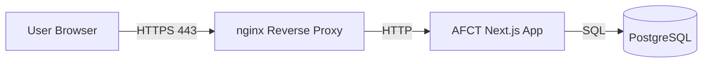
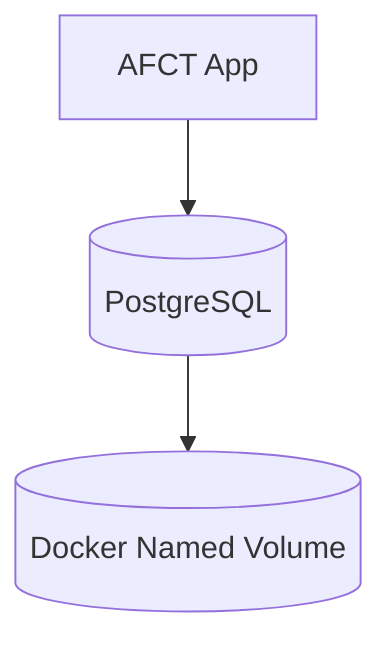

# AFCT Production Deployment Guide

This guide describes how to deploy **AFCT** in a **production environment** on **Windows, macOS, or Linux**. It takes you from a bare server to a running, HTTPS-enabled deployment, and covers the routine operations you will need afterward: updates, backups, and basic troubleshooting.

> **Docker is the preferred and fully supported deployment method.**
> Non-Docker setups are possible but **not recommended** and are not officially supported.

The Docker deployment is three containers (nginx, the app, PostgreSQL) managed by Docker Compose. You do not need to know Docker internals to operate it, but you should be comfortable running a handful of `docker compose` commands.

---

## Table of Contents

1. [Prerequisites](#1-prerequisites)
2. [Install Docker](#2-install-docker)
3. [Get the Code](#3-get-the-code)
4. [Configure Production Environment](#4-configure-production-environment)
5. [TLS / HTTPS Certificates](#5-tls--https-certificates)
6. [Architecture Overview](#6-architecture-overview)
7. [Start the Stack](#7-start-the-stack)
8. [Verify Deployment](#8-verify-deployment)
9. [Updating AFCT](#9-updating-afct)
10. [Backups](#10-backups)
11. [Troubleshooting](#11-troubleshooting)
12. [Optional: Non-Docker Setup (Not Recommended)](#optional-non-docker-setup-not-recommended)

---

## 1) Prerequisites

Before you begin, make sure you have:

- A server or host with **at least 2 CPU cores and 4 GB RAM**
- A **public DNS record** pointing your domain to the server's IP
- Firewall ports **80 (HTTP)** and **443 (HTTPS)** open
- `git` installed

Get the DNS record in place before you start, not after. The value you put in `NEXTAUTH_URL` (section 4) must match the domain users actually reach the server on, and authentication misbehaves in confusing ways when it does not. Port 80 stays open even though all real traffic is HTTPS, because nginx uses it to redirect visitors to 443.

> AFCT uses **Docker named volumes** for persistence.
> No host directories are required.

That last point simplifies operations: there are no paths on the host to create, permission, or back up directly. The database and uploads live in volumes Docker manages, and section 10 covers getting data out of them for backups.

---

## 2) Install Docker

You need the Docker engine and the Compose plugin. The verification commands in each section below confirm both; do not proceed until they succeed.

### Windows (Windows Server 2022 or Windows 11)

1. Install **Docker Desktop** and enable **WSL 2**
   [https://docs.docker.com/desktop/install/windows-install/](https://docs.docker.com/desktop/install/windows-install/)
2. During installation, ensure:
   - _Use WSL 2 instead of Hyper-V_ is enabled

3. Verify installation in PowerShell:

```powershell
wsl --status
docker --version
docker compose version
```

`wsl --status` should report a WSL 2 default. If `docker compose version` fails while `docker --version` works, the Compose plugin is missing; updating Docker Desktop fixes it.

---

### macOS (Apple Silicon or Intel)

1. Install **Docker Desktop**
   [https://docs.docker.com/desktop/install/mac-install/](https://docs.docker.com/desktop/install/mac-install/)
2. Verify:

```bash
docker --version
docker compose version
```

Both should print version strings. If Docker commands hang instead, Docker Desktop is not running yet.

---

### Linux (Ubuntu / Debian example)

Most production deployments land here. On Linux you install Docker Engine directly; the block below adds Docker's apt repository and installs the engine along with the Compose and buildx plugins:

```bash
sudo apt update
sudo apt install -y ca-certificates curl gnupg
sudo install -m 0755 -d /etc/apt/keyrings

curl -fsSL https://download.docker.com/linux/ubuntu/gpg | \
  sudo gpg --dearmor -o /etc/apt/keyrings/docker.gpg

sudo chmod a+r /etc/apt/keyrings/docker.gpg

printf "%s" \
  "deb [arch=$(dpkg --print-architecture) signed-by=/etc/apt/keyrings/docker.gpg] \
  https://download.docker.com/linux/ubuntu \
  $(. /etc/os-release && echo $VERSION_CODENAME) stable" | \
  sudo tee /etc/apt/sources.list.d/docker.list > /dev/null

sudo apt update
sudo apt install -y docker-ce docker-ce-cli containerd.io \
  docker-buildx-plugin docker-compose-plugin
```

Allow your user to run Docker without `sudo` (log out/in after):

```bash
sudo usermod -aG docker $USER
```

The group membership only takes effect in new login sessions. Until you log out and back in, `docker` commands will fail with a permission error on the Docker socket, which looks alarming but just means the group change has not applied yet.

Verify:

```bash
docker --version
docker compose version
```

---

## 3) Get the Code

```bash
git clone https://github.com/PennStateWilkes-Barre/AFCT-Dashboard.git
cd AFCT-Dashboard
```

Run all remaining commands from this directory. Keeping the deployment as a git clone (rather than a downloaded snapshot) is deliberate: it makes updates a `git pull` away, as described in section 9.

---

## 4) Configure Production Environment

Create your production environment file from the template.

```bash
cp .env.production.example .env.production
nano .env.production
```

The template documents each variable. Most defaults are fine, but the two below are not optional and getting them wrong is the most common cause of a broken first deployment.

### Important Notes

- **NEXTAUTH_SECRET** signs session tokens. Use a long random value:

```bash
openssl rand -base64 64
```

Generate it once, paste it in, and treat it like a password. If it leaks, an attacker can forge sessions; if you change it later, every user gets logged out.

- **NEXTAUTH_URL** must match your public HTTPS domain:

```
https://your-domain.com
```

This must be the exact scheme and hostname users type into their browser. A mismatch (http instead of https, a bare IP, the wrong subdomain) produces login redirect loops rather than a clear error, so double-check it now.

- **hCaptcha** is optional. hCaptcha only appears as a challenge after repeated failed logins; a fresh install works without it. You can configure it later from the browser under **System Settings > Security > hCaptcha** (this takes precedence over the env vars), or pre-seed the keys here via `NEXT_PUBLIC_HCAPTCHA_SITE_KEY` and `HCAPTCHA_SECRET_KEY` from the hCaptcha dashboard (<https://dashboard.hcaptcha.com/sites>). Never reuse the public test keys in production; they auto-pass every challenge, which defeats the point.

---

## 5) TLS / HTTPS Certificates

On first startup AFCT **automatically generates a self-signed certificate**, so
HTTPS works immediately with no configuration. Browsers will show a "not secure"
warning until you install a trusted certificate. For a trusted internal network
this is often acceptable; for a public site, install your own certificate.

The practical upshot: you can deploy first and sort out certificates second. Nothing in the setup blocks on having a real certificate in hand.

### Managing certificates from the admin interface (recommended)

You can install and replace your TLS certificate from the browser, with no shell
access and no file copying:

1. Sign in as an **admin** and open **System Settings**.
2. In the **TLS Certificate** card you'll see the active certificate (or
   "self-signed (default)").
3. Upload your **Certificate (PEM)** and **Private key (PEM)**. If your CA
   provided intermediate/chain certificates, add them under **Chain /
   intermediates**.
4. Click **Apply certificate**. It takes effect within about **15 seconds**, with no
   restart needed.
5. To revert at any time, click **Reset to self-signed**.

The certificate and key are validated before they're applied (the key must match
the certificate and it must not be expired). If a certificate is invalid, it is
rejected and the current one is kept, so HTTPS can never go down from a bad
upload. The private key is stored securely and is never shown again.

That validation step is worth knowing about when things go wrong: if your upload is rejected, the message will tell you whether the problem is a key/certificate mismatch (usually the wrong key file) or an expired certificate, and your existing HTTPS keeps working while you sort it out.

> **Where to get a certificate:** a public site can use a free certificate from
> [Let's Encrypt](https://letsencrypt.org/) (e.g. via `certbot`); an internal
> deployment can use a certificate issued by your organization's internal CA.

---

## 6) Architecture Overview

AFCT is deployed as a containerized, three-tier architecture using Docker Compose. Knowing which container does what pays off later, because troubleshooting (section 11) is mostly a matter of figuring out which tier a problem lives in.

### High-Level Architecture



### Container Responsibilities

| Container     | Purpose                                              |
| ------------- | ---------------------------------------------------- |
| afct-nginx    | TLS termination, reverse proxy, HTTP-to-HTTPS redirect |
| afct-app      | Next.js production server (UI + API routes)          |
| afct-postgres | PostgreSQL persistent database                       |

nginx is the only container the outside world talks to. It handles the TLS handshake and forwards plain HTTP to the app on the internal Docker network. The app talks to Postgres over that same private network.

### Data Persistence Model



Containers are disposable; volumes are not. Stopping, removing, or rebuilding containers leaves the data untouched, because everything that matters lives in named volumes. The only operations that destroy data are ones that explicitly remove volumes.

### Security Boundaries

- Only **nginx** exposes ports **80** and **443**
- App and database are isolated on a private Docker network
- Secrets are injected via environment variables
- Containers can be replaced without data loss

In particular, PostgreSQL is not reachable from outside the host at all. If you need database access for maintenance, go through `docker exec` as shown in the backups section.

---

## 7) Start the Stack

```bash
docker compose up -d
```

The `-d` runs everything in the background. The first startup takes longer than subsequent ones: images are pulled, the database initializes its volume, migrations run, and the self-signed certificate is generated. Give it a minute or two before judging whether it worked, then move on to verification.

---

## 8) Verify Deployment

```bash
docker compose ps
docker compose logs -f app
```

`ps` should list all three containers as `Up`. A container cycling through `Restarting` is crash-looping, and the logs will say why. In the app logs, you are looking for the Next.js server reporting that it is listening; database connection errors during the first seconds are usually just the app winning the race against Postgres and retrying, but errors that persist mean a real configuration problem.

Once the containers look healthy, confirm end to end from a browser:

Open:

```
https://your-domain.com
```

You should get the AFCT login page over HTTPS. If you have not installed a certificate yet, expect the browser's self-signed warning; that still counts as working. If the page does not load at all, work backward: DNS, then firewall, then `docker compose ps`.

---

## 9) Updating AFCT

```bash
git pull
docker compose pull
docker compose up -d
```

Three steps: fetch the latest code and compose configuration, pull updated images, and recreate whatever changed. Compose only restarts containers whose image or configuration actually differs, so an update where nothing changed is a no-op. Data survives updates because it lives in named volumes, but taking a backup first (next section) before any update is cheap insurance.

---

## 10) Backups

The database is the state worth protecting. Dump it to a file on the host:

```bash
docker exec afct-postgres pg_dump -U afct_user afct > backup.sql
```

This produces a plain SQL dump you can store, copy off the server, and rotate on whatever schedule your recovery requirements demand. The dump is taken while the database is live; no downtime is needed.

Restore:

```bash
docker exec -i afct-postgres psql -U afct_user afct < backup.sql
```

Restoring replays the dump into the database. A backup you have never test-restored is a hope, not a backup, so run a restore drill at least once before you need it in anger.

---

## 11) Troubleshooting

Start by locating the failing tier: is it nginx (nothing loads, TLS errors), the app (pages error out, logins fail), or the database (the app logs connection errors)? The two commands below answer most questions.

- Check container status:

```bash
docker compose ps
```

All three containers should be `Up`. `Exited` means a container died and stayed down; `Restarting` means it is crash-looping. In either case the container's logs contain the fatal error, usually in the last few lines.

- View logs:

```bash
docker compose logs -f app
```

The app logs are where application-level problems surface: failed migrations, missing environment variables, and database connectivity errors all show up here with reasonably specific messages. Read the first error in a burst, not the last; later errors are often just fallout from the first one.

- TLS warnings indicate missing or invalid certificates. A browser warning on a fresh install is expected (you are still on the self-signed certificate) and section 5 covers replacing it. A warning appearing on a previously trusted site usually means the certificate has expired and needs renewing through the same admin interface.

---

## Optional: Non-Docker Setup (Not Recommended)

Docker is the only supported production deployment. Manual setups require installing Node.js, PostgreSQL, and nginx and mirroring `.env.production`. You take on TLS termination, process supervision, database provisioning, and the startup sequencing that the Docker setup otherwise handles for you. If you go this route anyway, the application side looks like this:

### Node.js (No Docker)

```bash
npm install
npm run build
npm run db:generate
npm run db:deploy
npm start
```

In order: install dependencies, build the production bundle, generate the Prisma client, apply migrations to your database, and start the production server. `db:deploy` applies existing migrations without prompting, which is what you want in production; if it cannot connect, fix your database configuration before anything else.

**Requirements:**

- Node.js 22+
- PostgreSQL 15+
- Java 21+
