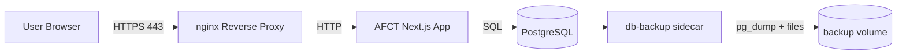

# AFCT Production Deployment Guide

This guide describes how to deploy **AFCT** in a **production environment** on **Windows, macOS, or Linux**. It takes you from a bare server to a running, HTTPS-enabled deployment, and covers the routine operations you will need afterward: updates, backups, and basic troubleshooting.

> **Docker is the preferred and fully supported deployment method.**
> Non-Docker setups are possible but **not recommended** and are not officially supported.

There are **two ways to install**, and both end at the same running stack:

- **Option A: Guided installer (recommended).** One command runs a short wizard that generates your secrets, asks for your admin details, and brings everything up. Best for most people. _(`install.sh` on Linux/macOS, `install.ps1` on Windows.)_
- **Option B: Manual setup (advanced).** You clone the repository, edit the environment file yourself, and run Docker Compose. Choose this if you want full control, are on Windows, or are scripting your own provisioning.

The Docker deployment is four containers (nginx, the app, PostgreSQL, and a backup sidecar) managed by Docker Compose. You do not need to know Docker internals to operate it, but you should be comfortable running a handful of `docker compose` commands.

---

## Table of Contents

1. [Prerequisites](#1-prerequisites)
2. [Install Docker](#2-install-docker)
3. [Install AFCT](#3-install-afct)
   - [Option A: Guided installer (recommended)](#option-a-guided-installer-recommended)
   - [Option B: Manual setup (advanced)](#option-b-manual-setup-advanced)
4. [TLS / HTTPS Certificates](#4-tls--https-certificates)
5. [Architecture Overview](#5-architecture-overview)
6. [Verify Deployment](#6-verify-deployment)
7. [Updating AFCT](#7-updating-afct)
8. [Backups](#8-backups)
9. [Troubleshooting](#9-troubleshooting)
10. [Optional: Non-Docker Setup (Not Recommended)](#optional-non-docker-setup-not-recommended)

---

## 1) Prerequisites

Before you begin, make sure you have:

- A server or host with **at least 2 CPU cores and 6 GB RAM** (the app container alone is capped at 4 GB, plus Postgres and the sidecars; 4 GB total is the bare minimum and will be tight)
- A **public DNS record** pointing your domain to the server's IP
- Firewall ports **80 (HTTP)** and **443 (HTTPS)** open
- `git` installed **(only needed for Option B, the manual path)**

Get the DNS record in place before you start, not after. The value you put in `NEXTAUTH_URL` must match the domain users actually reach the server on, and authentication misbehaves in confusing ways when it does not. Port 80 stays open even though all real traffic is HTTPS, because nginx uses it to redirect visitors to 443.

> AFCT uses **Docker named volumes** for persistence.
> No host directories are required.

That last point simplifies operations: there are no paths on the host to create, permission, or back up directly. The database and uploads live in volumes Docker manages, and section 8 covers getting data out of them for backups.

---

## 2) Install Docker

You need the Docker engine and the Compose plugin, for **both** install options. The verification commands in each section below confirm both; do not proceed until they succeed.

### Windows (Windows Server 2022 or Windows 11)

1. Install **Docker Desktop** and enable **WSL 2**
   [https://docs.docker.com/desktop/install/windows-install/](https://docs.docker.com/desktop/install/windows-install/)
2. During installation, ensure:
   - _Use WSL 2 instead of Hyper-V_ is enabled

3. Verify installation in PowerShell:

```powershell
wsl --status
docker --version
docker compose version
```

`wsl --status` should report a WSL 2 default. If `docker compose version` fails while `docker --version` works, the Compose plugin is missing; updating Docker Desktop fixes it.

> On Windows, the guided installer (Option A) is `install.ps1`, run from PowerShell. You can also use **Option B** (manual) or run `install.sh` inside a WSL 2 shell.

---

### macOS (Apple Silicon or Intel)

1. Install **Docker Desktop**
   [https://docs.docker.com/desktop/install/mac-install/](https://docs.docker.com/desktop/install/mac-install/)
2. In Docker Desktop settings, enable **"Start Docker Desktop when you log in"** so the app restarts after a reboot.
3. Verify:

```bash
docker --version
docker compose version
```

Both should print version strings. If Docker commands hang instead, Docker Desktop is not running yet.

---

### Linux (Ubuntu / Debian example)

Most production deployments land here. On Linux you install Docker Engine directly; the block below adds Docker's apt repository and installs the engine along with the Compose and buildx plugins:

```bash
sudo apt update
sudo apt install -y ca-certificates curl gnupg
sudo install -m 0755 -d /etc/apt/keyrings

curl -fsSL https://download.docker.com/linux/ubuntu/gpg | \
  sudo gpg --dearmor -o /etc/apt/keyrings/docker.gpg

sudo chmod a+r /etc/apt/keyrings/docker.gpg

printf "%s" \
  "deb [arch=$(dpkg --print-architecture) signed-by=/etc/apt/keyrings/docker.gpg] \
  https://download.docker.com/linux/ubuntu \
  $(. /etc/os-release && echo $VERSION_CODENAME) stable" | \
  sudo tee /etc/apt/sources.list.d/docker.list > /dev/null

sudo apt update
sudo apt install -y docker-ce docker-ce-cli containerd.io \
  docker-buildx-plugin docker-compose-plugin
```

Allow your user to run Docker without `sudo` (log out/in after):

```bash
sudo usermod -aG docker $USER
```

The group membership only takes effect in new login sessions. Until you log out and back in, `docker` commands will fail with a permission error on the Docker socket, which looks alarming but just means the group change has not applied yet.

Verify:

```bash
docker --version
docker compose version
```

---

## 3) Install AFCT

Pick **one** of the two options below. Both produce the same four-container stack; the rest of this guide (TLS, verification, updates, backups) applies either way.

### Option A: Guided installer (recommended)

The installer is a small self-contained bundle: a script plus a compose file. It checks your prerequisites, asks a few questions, generates strong secrets, and brings the stack up. Use **`install.sh`** on Linux/macOS or **`install.ps1`** (PowerShell) on Windows.

**Once this repository is public**, download the three files and run the script:

```bash
BASE=https://raw.githubusercontent.com/PennStateWilkes-Barre/AFCT-Dashboard/main/deploy
mkdir afct && cd afct
wget "$BASE/install.sh" "$BASE/docker-compose.yml" "$BASE/.env.production.example"
sh install.sh
```

**While the repository is still private**, the files and images require authentication:

```bash
docker login ghcr.io                 # once, if not already logged in
git clone https://github.com/PennStateWilkes-Barre/AFCT-Dashboard.git
cd AFCT-Dashboard/deploy
sh install.sh
```

**On Windows**, install Docker Desktop, then in **PowerShell** (once public):

```powershell
$base = 'https://raw.githubusercontent.com/PennStateWilkes-Barre/AFCT-Dashboard/main/deploy'
foreach ($f in 'install.ps1', 'docker-compose.yml', '.env.production.example') {
  Invoke-WebRequest "$base/$f" -OutFile $f
}
.\install.ps1
```

(While private: `docker login ghcr.io`, clone the repo, then run `.\install.ps1` from `deploy\`. If the script is blocked, use `powershell -ExecutionPolicy Bypass -File .\install.ps1`.)

The wizard will:

1. Verify Docker + Compose are installed and running, and (on Linux) enable Docker to start on boot.
2. Ask for your **administrator email**, a **password** (type your own or let it generate a strong one), and the **public URL** of the site.
3. Generate the database password and auth secret automatically and write them to `.env.production` (readable only by you).
4. Pull the images and start the stack, then print your URL and admin login.

If anything goes wrong, the installer drops a **redacted** `afct-diagnostics-<timestamp>.zip` next to the script (you can also run `sh install.sh diagnostics`, or `.\install.ps1 diagnostics` on Windows, any time). Send that to your administrator for help. See `deploy/README.md` for the full reference, including the non-interactive mode.

When it finishes, skip to [section 4 (TLS)](#4-tls--https-certificates).

### Option B: Manual setup (advanced)

This is exactly what the installer automates. Use it for full control, on Windows, or when scripting your own provisioning. It runs from a git clone of the repository (which also makes updates a `git pull` away; see section 7).

**Get the code:**

```bash
git clone https://github.com/PennStateWilkes-Barre/AFCT-Dashboard.git
cd AFCT-Dashboard
```

Run all remaining commands from this directory.

**Configure the environment** from the template:

```bash
cp .env.production.example .env.production
nano .env.production
```

The template documents every variable. Most defaults are fine, but these are not optional and getting them wrong is the most common cause of a broken first deployment:

- **POSTGRES_PASSWORD**: pick a long random value, and make sure the same value appears inside **DATABASE_URL**.
- **ADMIN_EMAIL / ADMIN_PASSWORD**: the initial administrator, seeded on the first run against an empty database.
- **NEXTAUTH_SECRET**: signs session tokens. Generate a long random value once and treat it like a password:

  ```bash
  openssl rand -base64 64
  ```

  If it leaks, an attacker can forge sessions; if you change it later, every user gets logged out.

- **NEXTAUTH_URL**: must match your public HTTPS domain exactly (`https://your-domain.com`). A mismatch (http instead of https, a bare IP, the wrong subdomain) produces login redirect loops rather than a clear error, so double-check it now.
- **hCaptcha** is optional. It only appears as a challenge after repeated failed logins; a fresh install works without it. Configure it later under **System Settings → Security → hCaptcha** (which takes precedence over the env vars), or pre-seed `NEXT_PUBLIC_HCAPTCHA_SITE_KEY` and `HCAPTCHA_SECRET_KEY`. Never reuse the public test keys in production.

**Start the stack:**

```bash
docker compose up -d
```

The `-d` runs everything in the background. The first startup takes longer than subsequent ones: images are pulled, the database initializes its volume, migrations run, the admin is seeded, and the self-signed certificate is generated. Give it a minute or two, then continue to verification (section 6).

---

## 4) TLS / HTTPS Certificates

On first startup AFCT **automatically generates a self-signed certificate**, so HTTPS works immediately with no configuration. Browsers will show a "not secure" warning until you install a trusted certificate. For a trusted internal network this is often acceptable; for a public site, install your own certificate.

The practical upshot: you can deploy first and sort out certificates second. Nothing in the setup blocks on having a real certificate in hand.

### Managing certificates from the admin interface (recommended)

You can install and replace your TLS certificate from the browser, with no shell access and no file copying:

1. Sign in as an **admin** and open **System Settings**.
2. In the **TLS Certificate** card you'll see the active certificate (or "self-signed (default)").
3. Upload your **Certificate (PEM)** and **Private key (PEM)**. If your CA provided intermediate/chain certificates, add them under **Chain / intermediates**. You can also generate a **CSR** here to send to your CA, or create a self-signed certificate for a specific hostname.
4. Click **Apply certificate**. It takes effect within about **15 seconds**, with no restart needed.
5. To revert at any time, click **Reset to self-signed**.

The certificate and key are validated before they're applied (the key must match the certificate and it must not be expired). If a certificate is invalid, it is rejected and the current one is kept, so HTTPS can never go down from a bad upload. The private key is stored securely and is never shown again.

> **Where to get a certificate:** a public site can use a free certificate from [Let's Encrypt](https://letsencrypt.org/) (e.g. via `certbot`); an internal deployment can use a certificate issued by your organization's internal CA.

---

## 5) Architecture Overview

AFCT is deployed as a containerized stack using Docker Compose. Knowing which container does what pays off later, because troubleshooting (section 9) is mostly a matter of figuring out which tier a problem lives in.

### High-Level Architecture



### Container Responsibilities

| Container       | Purpose                                                          |
| --------------- | --------------------------------------------------------------- |
| afct-nginx      | TLS termination, reverse proxy, HTTP-to-HTTPS redirect          |
| afct-app        | Next.js production server (UI + API routes)                     |
| afct-postgres   | PostgreSQL persistent database                                  |
| afct-db-backup  | Scheduled backups (database dump + uploads tarball); see §8     |

nginx is the only container the outside world talks to. It handles the TLS handshake and forwards plain HTTP to the app on the internal Docker network. The app talks to Postgres over that same private network. The backup sidecar reads the database and upload volumes and writes backup archives to a dedicated volume; it never accepts external traffic.

### Data Persistence Model

Containers are disposable; volumes are not. Stopping, removing, or rebuilding containers leaves the data untouched, because everything that matters (database, uploads, backups, certs) lives in named volumes. The only operations that destroy data are ones that explicitly remove volumes.

### Security Boundaries

- Only **nginx** exposes ports **80** and **443**
- App, database, and backup sidecar are isolated on a private Docker network
- Secrets are injected via environment variables (`.env.production`, kept `chmod 600`)
- Containers can be replaced without data loss

PostgreSQL is not reachable from outside the host at all. If you need database access for maintenance, go through `docker exec` as shown in the backups section.

---

## 6) Verify Deployment

```bash
docker compose ps
docker compose logs -f app
```

`ps` should list all four containers as `Up` (the app shows `Up (healthy)` once its health check passes). A container cycling through `Restarting` is crash-looping, and the logs will say why. In the app logs, you are looking for the Next.js server reporting that it is listening; database connection errors during the first seconds are usually just the app winning the race against Postgres and retrying, but errors that persist mean a real configuration problem.

Once the containers look healthy, confirm end to end from a browser:

```
https://your-domain.com
```

You should get the AFCT login page over HTTPS, and be able to sign in with the admin email/password you set during install. If you have not installed a certificate yet, expect the browser's self-signed warning; that still counts as working. If the page does not load at all, work backward: DNS, then firewall, then `docker compose ps`.

---

## 7) Updating AFCT

**Option A (installer bundle)**, from the folder that holds your `docker-compose.yml`:

```bash
docker compose pull
docker compose up -d
```

**Option B (git clone)**, also refresh the code/compose first:

```bash
git pull
docker compose pull
docker compose up -d
```

Compose only restarts containers whose image or configuration actually differs, so an update where nothing changed is a no-op. Data survives updates because it lives in named volumes, but taking a backup first (next section) before any update is cheap insurance.

> One-click **in-app updates** from the admin menu are planned for a future release; until then, use the commands above.

---

## 8) Backups

AFCT ships with an **automated backup sidecar** (`afct-db-backup`). On a daily schedule it writes a matched pair, a PostgreSQL dump plus a tarball of the upload volumes (database rows reference files by name, so both are needed for a coherent restore), to the `db_backups` volume, and prunes old ones.

- **Schedule, on/off, and retention** are set in the browser under **Admin → System Settings** (`backupEnabled` / `backupHour` / `backupRetentionDays`).
- **Back up now:** the same System Settings screen has an on-demand button.
- **Off-host copies:** the backups protect against bad data or a bad migration, **not** against losing the host. Copy the `db_backups` volume off the server regularly (e.g. `docker run --rm -v afct_db_backups:/b -v "$PWD":/out alpine tar czf /out/afct-backups.tar.gz -C /b .`).

### Manual database dump (optional)

You can also take an ad-hoc SQL dump directly:

```bash
docker exec afct-postgres pg_dump -U afct_user afct > backup.sql
```

Restore it with:

```bash
docker exec -i afct-postgres psql -U afct_user afct < backup.sql
```

A backup you have never test-restored is a hope, not a backup, so run a restore drill at least once before you need it in anger.

---

## 9) Troubleshooting

Start by locating the failing tier: is it nginx (nothing loads, TLS errors), the app (pages error out, logins fail), or the database (the app logs connection errors)? The two commands below answer most questions.

- Check container status:

```bash
docker compose ps
```

All four containers should be `Up`. `Exited` means a container died and stayed down; `Restarting` means it is crash-looping. In either case the container's logs contain the fatal error, usually in the last few lines.

- View logs:

```bash
docker compose logs -f app
```

The app logs are where application-level problems surface: failed migrations, missing environment variables, and database connectivity errors all show up here with reasonably specific messages. Read the first error in a burst, not the last; later errors are often just fallout from the first one.

- **Installer users:** run `sh install.sh diagnostics` (or `.\install.ps1 diagnostics` on Windows) to collect a redacted support bundle (`afct-diagnostics-<timestamp>.zip`) with the install log, container status/logs, and your config with secret values masked; hand that to your administrator.

- TLS warnings indicate missing or invalid certificates. A browser warning on a fresh install is expected (you are still on the self-signed certificate) and section 4 covers replacing it. A warning appearing on a previously trusted site usually means the certificate has expired and needs renewing through the same admin interface.

---

## Optional: Non-Docker Setup (Not Recommended)

Docker is the only supported production deployment. Manual setups require installing Node.js, PostgreSQL, and nginx and mirroring `.env.production`. You take on TLS termination, process supervision, database provisioning, and the startup sequencing that the Docker setup otherwise handles for you. If you go this route anyway, the application side looks like this:

### Node.js (No Docker)

```bash
npm install
npm run build
npm run db:generate
npm run db:deploy
npm start
```

In order: install dependencies, build the production bundle, generate the Prisma client, apply migrations to your database, and start the production server. `db:deploy` applies existing migrations without prompting, which is what you want in production; if it cannot connect, fix your database configuration before anything else.

**Requirements:**

- Node.js 22+
- PostgreSQL 15+
- Java 21+
