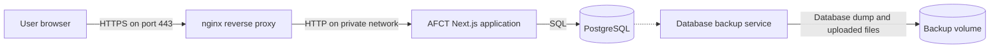

````markdown
# AFCT Production Deployment Guide

This guide explains how to deploy the **AFCT Dashboard** in a production environment using Docker.

Start by selecting the operating system of the computer or server that will run AFCT:

- [Deploy on Linux](#deploy-on-linux)
- [Deploy on Windows](#deploy-on-windows)
- [Deploy on macOS](#deploy-on-macos)

Each operating-system section contains the complete installation process for that platform. You do not need to read the installation instructions for the other operating systems.

After AFCT is running, use the shared sections to configure certificates, install updates, manage backups, and troubleshoot problems.

> **Docker is the preferred and fully supported production deployment method.**
>
> A non-Docker deployment is possible, but it is not recommended or officially supported.

---

## Choose an installation method

Each operating system supports two installation methods.

### Guided installer

The guided installer is recommended for most deployments. It:

- Checks that Docker is installed and running
- Collects the required server settings
- Generates secure secrets
- Creates the production environment file
- Downloads the AFCT container images
- Starts the application
- Produces a redacted diagnostic archive if installation fails

Use:

- `install.sh` on Linux
- `install.ps1` on Windows
- `install.sh` on macOS

### Manual installation

The manual installation gives you direct control over the repository, environment file, and Docker Compose commands.

Choose the manual method when you:

- Need to customize the deployment
- Are automating server provisioning
- Want to manage the repository directly with Git
- Need to inspect or modify the Docker Compose configuration

Both methods create the same four-container AFCT stack:

- nginx
- The AFCT application
- PostgreSQL
- The automated backup service

---

# Deploy on Linux

These instructions are intended for an Ubuntu production server. Other Linux distributions can run AFCT, but their Docker installation steps may differ.

## Linux requirements

Before installing AFCT, prepare a server with:

- At least **2 CPU cores**
- At least **6 GB of RAM**
- A public DNS record pointing to the server
- Firewall ports **80** and **443** open
- Internet access for downloading Docker and AFCT images
- Git, when using the manual installation method

The AFCT application container may use up to 4 GB of memory. PostgreSQL, nginx, the backup service, and the operating system also require memory. A server with only 4 GB of total RAM may run AFCT, but it provides very little room for updates, backups, or increased traffic.

## Configure Linux DNS and firewall settings

Create the DNS record before installing AFCT.

The value assigned to `NEXTAUTH_URL` must exactly match the address users will enter in their browsers. For example:

```text
https://afct.example.edu
```
````

Authentication may fail or enter a redirect loop when `NEXTAUTH_URL` contains:

- `http` instead of `https`
- The server's IP address instead of its domain
- The wrong subdomain
- An additional path
- An unnecessary port number

Port 80 must remain open even though AFCT uses HTTPS. nginx listens on port 80 and redirects HTTP requests to port 443.

## Install Docker on Linux

Update the package list and install the required packages:

```bash
sudo apt update
sudo apt install -y ca-certificates curl gnupg git
sudo install -m 0755 -d /etc/apt/keyrings
```

Add Docker's signing key:

```bash
curl -fsSL https://download.docker.com/linux/ubuntu/gpg | \
  sudo gpg --dearmor -o /etc/apt/keyrings/docker.gpg

sudo chmod a+r /etc/apt/keyrings/docker.gpg
```

Add Docker's Ubuntu package repository:

```bash
printf "%s" \
  "deb [arch=$(dpkg --print-architecture) signed-by=/etc/apt/keyrings/docker.gpg] \
  https://download.docker.com/linux/ubuntu \
  $(. /etc/os-release && echo "$VERSION_CODENAME") stable" | \
  sudo tee /etc/apt/sources.list.d/docker.list > /dev/null
```

Install Docker Engine and the required plugins:

```bash
sudo apt update
sudo apt install -y docker-ce docker-ce-cli containerd.io \
  docker-buildx-plugin docker-compose-plugin
```

Allow your account to run Docker without `sudo`:

```bash
sudo usermod -aG docker "$USER"
```

Log out of the server and sign in again before continuing. The group membership change does not affect your current login session.

Before signing in again, Docker commands may display a permission error involving the Docker socket. This normally means the group change has not taken effect yet.

Verify Docker:

```bash
docker --version
docker compose version
```

Both commands should display version information.

Confirm that Docker is running:

```bash
docker info
```

Do not continue until all three commands succeed.

## Install AFCT on Linux

Choose either the guided installer or the manual installation.

### Linux guided installer

The guided installer is recommended for most Linux deployments.

#### Public repository installation

Create an AFCT deployment directory:

```bash
mkdir afct
cd afct
```

Download the installer bundle:

```bash
BASE=https://raw.githubusercontent.com/PennStateWilkes-Barre/AFCT-Dashboard/main/deploy

curl -fLO "$BASE/install.sh"
curl -fLO "$BASE/docker-compose.yml"
curl -fLO "$BASE/.env.production.example"
```

Run the installer:

```bash
sh install.sh
```

#### Private repository installation

While the repository and container images remain private, authenticate with GitHub Container Registry:

```bash
docker login ghcr.io
```

Clone the repository:

```bash
git clone https://github.com/PennStateWilkes-Barre/AFCT-Dashboard.git
cd AFCT-Dashboard/deploy
```

Run the installer:

```bash
sh install.sh
```

You only need to run `docker login ghcr.io` again if the saved credentials expire or are removed.

#### Information requested by the installer

The installer will ask for:

- The initial administrator's email address
- The initial administrator's password
- The public AFCT URL

It will then:

1. Verify Docker and Docker Compose.
2. Enable Docker at startup when supported.
3. Generate a PostgreSQL password.
4. Generate the authentication secret.
5. Create `.env.production`.
6. Restrict access to the environment file.
7. Download the container images.
8. Start the AFCT stack.
9. Display the public URL and administrator account information.

#### Linux installer diagnostics

If installation fails, the installer creates a redacted archive in the installation directory:

```text
afct-diagnostics-<timestamp>.zip
```

You can also create the archive manually:

```bash
sh install.sh diagnostics
```

The archive contains:

- Installer logs
- Container status
- Container logs
- Configuration information with secret values removed

Review the archive before sharing it with an AFCT administrator or developer.

After installation, continue to [Verify AFCT on Linux](#verify-afct-on-linux).

### Linux manual installation

Use the manual installation when you need direct control over the deployment.

Clone the repository:

```bash
git clone https://github.com/PennStateWilkes-Barre/AFCT-Dashboard.git
cd AFCT-Dashboard
```

Run the remaining commands from the repository's root directory.

Create the production environment file:

```bash
cp .env.production.example .env.production
```

Open it in a text editor:

```bash
nano .env.production
```

Configure the required values described below.

#### `POSTGRES_PASSWORD`

Set a long, randomly generated database password.

The same password must appear in `DATABASE_URL`. A mismatch prevents AFCT from connecting to PostgreSQL.

#### `ADMIN_EMAIL` and `ADMIN_PASSWORD`

These values create the initial administrator when AFCT starts with an empty database.

The account is only seeded during initial database setup. Changing these environment variables later does not automatically update an existing administrator account.

#### `NEXTAUTH_SECRET`

Generate a long random authentication secret:

```bash
openssl rand -base64 64
```

Store the generated value in `NEXTAUTH_SECRET`.

Generate this value once and protect it like a password.

If the secret is exposed, an attacker may be able to forge authentication data. Changing it later invalidates existing sessions and requires every user to sign in again.

#### `NEXTAUTH_URL`

Set this to the exact public HTTPS address:

```text
NEXTAUTH_URL=https://afct.example.edu
```

Do not use:

- An HTTP URL
- A local address
- A server IP address
- The wrong subdomain
- A URL users will not actually visit

#### hCaptcha settings

hCaptcha is optional. AFCT can start and operate without it.

You may configure it later under:

**System Settings → Security → hCaptcha**

To configure it during deployment, set:

- `NEXT_PUBLIC_HCAPTCHA_SITE_KEY`
- `HCAPTCHA_SECRET_KEY`

Settings stored through the AFCT administration interface take precedence over the environment variables.

Do not use hCaptcha's public test credentials in production.

#### Protect the environment file

Restrict access to the file:

```bash
chmod 600 .env.production
```

The file contains database credentials and authentication secrets. Do not commit it to Git or include it in support archives.

#### Start AFCT

Start the Docker Compose stack:

```bash
docker compose up -d
```

The first startup may take longer than later startups because Docker must:

- Download the container images
- Initialize PostgreSQL
- Apply database migrations
- Create the initial administrator
- Generate the default self-signed certificate
- Start application health checks

## Verify AFCT on Linux

Check the container status:

```bash
docker compose ps
```

All four containers should report an `Up` status.

The application container should eventually report:

```text
Up (healthy)
```

Review the application logs:

```bash
docker compose logs -f app
```

Press `Ctrl+C` to stop following the logs. This does not stop AFCT.

Brief database connection errors during the first few seconds may occur if the application starts before PostgreSQL is ready. Errors that continue indicate a configuration problem.

Open the public URL in a browser:

```text
https://your-domain.com
```

Confirm that:

1. The AFCT login page loads.
2. The connection uses HTTPS.
3. You can sign in with the administrator account.
4. The administration pages load successfully.

A browser warning is expected while AFCT is using its default self-signed certificate.

After AFCT is running, continue to [Configure TLS and HTTPS](#configure-tls-and-https).

---

# Deploy on Windows

These instructions apply to a Windows computer using Docker Desktop and WSL 2.

## Windows requirements

Before installing AFCT, prepare a Windows computer with:

- At least **2 CPU cores**
- At least **6 GB of RAM**
- A public DNS record pointing to the computer
- Firewall ports **80** and **443** open
- Docker Desktop
- WSL 2
- Git, when using the manual installation method

The AFCT application container may use up to 4 GB of memory. PostgreSQL, nginx, the backup service, Docker Desktop, and Windows also require memory.

## Configure Windows DNS and firewall settings

Create the DNS record before installing AFCT.

The value assigned to `NEXTAUTH_URL` must exactly match the public address users will enter. For example:

```text
https://afct.example.edu
```

Authentication may fail or enter a redirect loop when the value uses:

- `http` instead of `https`
- The computer's IP address instead of its domain
- The wrong subdomain
- An additional path
- An unnecessary port number

Allow inbound connections on ports:

- **80** for HTTP redirects
- **443** for HTTPS traffic

## Install Docker on Windows

Install [Docker Desktop for Windows](https://docs.docker.com/desktop/install/windows-install/).

During installation, enable:

**Use WSL 2 instead of Hyper-V**

Start Docker Desktop and wait until it reports that Docker is running.

Open PowerShell and verify WSL:

```powershell
wsl --status
```

Verify Docker:

```powershell
docker --version
docker compose version
docker info
```

`wsl --status` should indicate that WSL 2 is available.

The Docker commands should display version and server information. If `docker --version` succeeds but `docker compose version` fails, update Docker Desktop.

Do not continue until Docker Desktop is running and all commands succeed.

## Install AFCT on Windows

Choose either the guided installer or the manual installation.

### Windows guided installer

The PowerShell installer is recommended for most Windows deployments.

#### Public repository installation

Open PowerShell and create an AFCT deployment directory:

```powershell
New-Item -ItemType Directory -Path afct -Force | Out-Null
Set-Location afct
```

Download the installer bundle:

```powershell
$base = 'https://raw.githubusercontent.com/PennStateWilkes-Barre/AFCT-Dashboard/main/deploy'

foreach ($file in 'install.ps1', 'docker-compose.yml', '.env.production.example') {
    Invoke-WebRequest "$base/$file" -OutFile $file
}
```

Run the installer:

```powershell
.\install.ps1
```

#### Private repository installation

While the repository and container images remain private, authenticate with GitHub Container Registry:

```powershell
docker login ghcr.io
```

Clone the repository:

```powershell
git clone https://github.com/PennStateWilkes-Barre/AFCT-Dashboard.git
Set-Location .\AFCT-Dashboard\deploy
```

Run the installer:

```powershell
.\install.ps1
```

If PowerShell blocks the script, run:

```powershell
powershell -ExecutionPolicy Bypass -File .\install.ps1
```

You only need to run `docker login ghcr.io` again if the saved credentials expire or are removed.

#### Information requested by the installer

The installer will ask for:

- The initial administrator's email address
- The initial administrator's password
- The public AFCT URL

It will then:

1. Verify Docker and Docker Compose.
2. Generate a PostgreSQL password.
3. Generate the authentication secret.
4. Create `.env.production`.
5. Download the container images.
6. Start the AFCT stack.
7. Display the public URL and administrator account information.

#### Windows installer diagnostics

If installation fails, the installer creates a redacted archive in the installation directory:

```text
afct-diagnostics-<timestamp>.zip
```

You can also create it manually:

```powershell
.\install.ps1 diagnostics
```

The archive contains:

- Installer logs
- Container status
- Container logs
- Configuration information with secret values removed

Review the archive before sharing it with an AFCT administrator or developer.

After installation, continue to [Verify AFCT on Windows](#verify-afct-on-windows).

### Windows manual installation

Use the manual installation when you need direct control over the deployment.

Clone the repository:

```powershell
git clone https://github.com/PennStateWilkes-Barre/AFCT-Dashboard.git
Set-Location .\AFCT-Dashboard
```

Run the remaining commands from the repository's root directory.

Create the production environment file:

```powershell
Copy-Item .env.production.example .env.production
```

Open it in Notepad:

```powershell
notepad .env.production
```

Configure the required values described below.

#### `POSTGRES_PASSWORD`

Set a long, randomly generated database password.

The same password must appear in `DATABASE_URL`. A mismatch prevents AFCT from connecting to PostgreSQL.

#### `ADMIN_EMAIL` and `ADMIN_PASSWORD`

These values create the initial administrator when AFCT starts with an empty database.

The account is only seeded during initial database setup. Changing these values later does not update an existing administrator account.

#### `NEXTAUTH_SECRET`

Generate a random authentication secret in PowerShell:

```powershell
$bytes = New-Object byte[] 64
[System.Security.Cryptography.RandomNumberGenerator]::Fill($bytes)
[Convert]::ToBase64String($bytes)
```

Copy the displayed value into `NEXTAUTH_SECRET`.

Generate this value once and protect it like a password.

If the secret is exposed, an attacker may be able to forge authentication data. Changing it later invalidates existing sessions and requires every user to sign in again.

#### `NEXTAUTH_URL`

Set this to the exact public HTTPS address:

```text
NEXTAUTH_URL=https://afct.example.edu
```

Do not use:

- An HTTP URL
- A local address
- A server IP address
- The wrong subdomain
- A URL users will not actually visit

#### hCaptcha settings

hCaptcha is optional. AFCT can start and operate without it.

You may configure it later under:

**System Settings → Security → hCaptcha**

To configure it during deployment, set:

- `NEXT_PUBLIC_HCAPTCHA_SITE_KEY`
- `HCAPTCHA_SECRET_KEY`

Settings stored through the AFCT administration interface take precedence over the environment variables.

Do not use hCaptcha's public test credentials in production.

#### Protect the environment file

`.env.production` contains database credentials and authentication secrets.

Do not:

- Commit it to Git
- Attach it to a support request
- Store it in a publicly shared folder
- Send it through unencrypted email

Limit access to the Windows account responsible for administering AFCT.

#### Start AFCT

Start the Docker Compose stack:

```powershell
docker compose up -d
```

The first startup may take longer than later startups because Docker must:

- Download the container images
- Initialize PostgreSQL
- Apply database migrations
- Create the initial administrator
- Generate the default self-signed certificate
- Start application health checks

## Verify AFCT on Windows

Check the container status:

```powershell
docker compose ps
```

All four containers should report an `Up` status.

The application container should eventually report:

```text
Up (healthy)
```

Review the application logs:

```powershell
docker compose logs -f app
```

Press `Ctrl+C` to stop following the logs. This does not stop AFCT.

Brief database connection errors during the first few seconds may occur if the application starts before PostgreSQL is ready. Errors that continue indicate a configuration problem.

Open the public URL in a browser:

```text
https://your-domain.com
```

Confirm that:

1. The AFCT login page loads.
2. The connection uses HTTPS.
3. You can sign in with the administrator account.
4. The administration pages load successfully.

A browser warning is expected while AFCT is using its default self-signed certificate.

After AFCT is running, continue to [Configure TLS and HTTPS](#configure-tls-and-https).

---

# Deploy on macOS

These instructions apply to both Apple Silicon and Intel-based Macs.

## macOS requirements

Before installing AFCT, prepare a Mac with:

- At least **2 CPU cores**
- At least **6 GB of RAM**
- A public DNS record pointing to the Mac
- Firewall ports **80** and **443** open
- Docker Desktop
- Git, when using the manual installation method

The AFCT application container may use up to 4 GB of memory. PostgreSQL, nginx, the backup service, Docker Desktop, and macOS also require memory.

A Mac can host AFCT, but a continuously available Linux server is generally a better choice for a long-term public deployment.

## Configure macOS DNS and network settings

Create the DNS record before installing AFCT.

The value assigned to `NEXTAUTH_URL` must exactly match the public address users will enter. For example:

```text
https://afct.example.edu
```

Authentication may fail or enter a redirect loop when the value uses:

- `http` instead of `https`
- The Mac's IP address instead of its domain
- The wrong subdomain
- An additional path
- An unnecessary port number

The network and firewall must allow inbound traffic on ports:

- **80** for HTTP redirects
- **443** for HTTPS traffic

## Install Docker on macOS

Install [Docker Desktop for Mac](https://docs.docker.com/desktop/install/mac-install/).

Choose the installer that matches your processor:

- Apple Silicon
- Intel

Open Docker Desktop.

In Docker Desktop settings, enable:

**Start Docker Desktop when you log in**

This allows AFCT to return after the Mac restarts and Docker Desktop starts.

Open Terminal and verify Docker:

```bash
docker --version
docker compose version
docker info
```

All commands should display version or server information.

If the commands hang or report that they cannot connect to the Docker daemon, Docker Desktop has not finished starting.

Do not continue until all commands succeed.

## Install AFCT on macOS

Choose either the guided installer or the manual installation.

### macOS guided installer

The guided installer is recommended for most macOS deployments.

#### Public repository installation

Create an AFCT deployment directory:

```bash
mkdir afct
cd afct
```

Download the installer bundle:

```bash
BASE=https://raw.githubusercontent.com/PennStateWilkes-Barre/AFCT-Dashboard/main/deploy

curl -fLO "$BASE/install.sh"
curl -fLO "$BASE/docker-compose.yml"
curl -fLO "$BASE/.env.production.example"
```

Run the installer:

```bash
sh install.sh
```

#### Private repository installation

While the repository and container images remain private, authenticate with GitHub Container Registry:

```bash
docker login ghcr.io
```

Clone the repository:

```bash
git clone https://github.com/PennStateWilkes-Barre/AFCT-Dashboard.git
cd AFCT-Dashboard/deploy
```

Run the installer:

```bash
sh install.sh
```

You only need to run `docker login ghcr.io` again if the saved credentials expire or are removed.

#### Information requested by the installer

The installer will ask for:

- The initial administrator's email address
- The initial administrator's password
- The public AFCT URL

It will then:

1. Verify Docker and Docker Compose.
2. Generate a PostgreSQL password.
3. Generate the authentication secret.
4. Create `.env.production`.
5. Restrict access to the environment file.
6. Download the container images.
7. Start the AFCT stack.
8. Display the public URL and administrator account information.

#### macOS installer diagnostics

If installation fails, the installer creates a redacted archive in the installation directory:

```text
afct-diagnostics-<timestamp>.zip
```

You can also create it manually:

```bash
sh install.sh diagnostics
```

The archive contains:

- Installer logs
- Container status
- Container logs
- Configuration information with secret values removed

Review the archive before sharing it with an AFCT administrator or developer.

After installation, continue to [Verify AFCT on macOS](#verify-afct-on-macos).

### macOS manual installation

Use the manual installation when you need direct control over the deployment.

Clone the repository:

```bash
git clone https://github.com/PennStateWilkes-Barre/AFCT-Dashboard.git
cd AFCT-Dashboard
```

Run the remaining commands from the repository's root directory.

Create the production environment file:

```bash
cp .env.production.example .env.production
```

Open the file in a terminal editor:

```bash
nano .env.production
```

You may also open it in a graphical editor:

```bash
open -e .env.production
```

Configure the required values described below.

#### `POSTGRES_PASSWORD`

Set a long, randomly generated database password.

The same password must appear in `DATABASE_URL`. A mismatch prevents AFCT from connecting to PostgreSQL.

#### `ADMIN_EMAIL` and `ADMIN_PASSWORD`

These values create the initial administrator when AFCT starts with an empty database.

The account is only seeded during initial database setup. Changing these values later does not update an existing administrator account.

#### `NEXTAUTH_SECRET`

Generate a long random authentication secret:

```bash
openssl rand -base64 64
```

Store the generated value in `NEXTAUTH_SECRET`.

Generate this value once and protect it like a password.

If the secret is exposed, an attacker may be able to forge authentication data. Changing it later invalidates existing sessions and requires every user to sign in again.

#### `NEXTAUTH_URL`

Set this to the exact public HTTPS address:

```text
NEXTAUTH_URL=https://afct.example.edu
```

Do not use:

- An HTTP URL
- A local address
- A server IP address
- The wrong subdomain
- A URL users will not actually visit

#### hCaptcha settings

hCaptcha is optional. AFCT can start and operate without it.

You may configure it later under:

**System Settings → Security → hCaptcha**

To configure it during deployment, set:

- `NEXT_PUBLIC_HCAPTCHA_SITE_KEY`
- `HCAPTCHA_SECRET_KEY`

Settings stored through the AFCT administration interface take precedence over the environment variables.

Do not use hCaptcha's public test credentials in production.

#### Protect the environment file

Restrict access to the file:

```bash
chmod 600 .env.production
```

The file contains database credentials and authentication secrets. Do not commit it to Git or include it in support archives.

#### Start AFCT

Start the Docker Compose stack:

```bash
docker compose up -d
```

The first startup may take longer than later startups because Docker must:

- Download the container images
- Initialize PostgreSQL
- Apply database migrations
- Create the initial administrator
- Generate the default self-signed certificate
- Start application health checks

## Verify AFCT on macOS

Check the container status:

```bash
docker compose ps
```

All four containers should report an `Up` status.

The application container should eventually report:

```text
Up (healthy)
```

Review the application logs:

```bash
docker compose logs -f app
```

Press `Control+C` to stop following the logs. This does not stop AFCT.

Brief database connection errors during the first few seconds may occur if the application starts before PostgreSQL is ready. Errors that continue indicate a configuration problem.

Open the public URL in a browser:

```text
https://your-domain.com
```

Confirm that:

1. The AFCT login page loads.
2. The connection uses HTTPS.
3. You can sign in with the administrator account.
4. The administration pages load successfully.

A browser warning is expected while AFCT is using its default self-signed certificate.

After AFCT is running, continue to [Configure TLS and HTTPS](#configure-tls-and-https).

---

# After installation

The remaining sections apply to Linux, Windows, and macOS deployments.

---

# Configure TLS and HTTPS

AFCT automatically generates a self-signed TLS certificate during its first startup. This allows HTTPS to work immediately, but browsers display a security warning because the certificate was not issued by a trusted certificate authority.

A self-signed certificate may be acceptable for a restricted internal testing environment. A public or institution-facing deployment should use a trusted certificate.

You may install AFCT first and replace the self-signed certificate afterward.

## Manage certificates from AFCT

The recommended method is to manage TLS certificates through the AFCT administration interface.

1. Sign in using an administrator account.
2. Open **System Settings**.
3. Locate the **TLS Certificate** section.
4. Upload the **Certificate** in PEM format.
5. Upload the matching **Private key** in PEM format.
6. Add any intermediate or chain certificates provided by the certificate authority.
7. Select **Apply certificate**.

AFCT validates the certificate before replacing the active certificate. It confirms that:

- The private key matches the certificate
- The certificate is not expired
- The certificate and key use supported formats

An invalid certificate is rejected, and the existing certificate remains active.

The new certificate normally becomes active within approximately 15 seconds. A container restart is not required.

The private key is stored securely and is not displayed again after it is uploaded.

## Generate a certificate signing request

The TLS settings interface can generate a certificate signing request, or CSR, for submission to a certificate authority.

A CSR contains the public information required by the certificate authority. It does not expose the private key.

## Return to a self-signed certificate

Select **Reset to self-signed** to remove the installed certificate and return to the automatically generated certificate.

## Obtain a trusted certificate

For a public deployment, you may obtain a free trusted certificate from [Let's Encrypt](https://letsencrypt.org/), commonly through a tool such as `certbot`.

For an internal deployment, your institution may provide a certificate through an internal certificate authority.

---

# Understand the deployment architecture

AFCT uses Docker Compose to run four cooperating containers.



## Container responsibilities

| Container        | Responsibility                                                                    |
| ---------------- | --------------------------------------------------------------------------------- |
| `afct-nginx`     | Terminates TLS, redirects HTTP to HTTPS, and forwards requests to the application |
| `afct-app`       | Runs the Next.js user interface and API routes                                    |
| `afct-postgres`  | Stores persistent application data in PostgreSQL                                  |
| `afct-db-backup` | Creates scheduled database and uploaded-file backups                              |

nginx is the only container that accepts traffic from outside the Docker network. It listens on ports 80 and 443 and forwards application requests to the AFCT container.

The application communicates with PostgreSQL through a private Docker network. PostgreSQL does not expose a public port.

The backup container reads the database and uploaded-file volumes and writes archives to a separate backup volume. It does not accept external traffic.

## Data persistence

Docker containers should be treated as replaceable. Persistent data is stored in Docker named volumes.

Stopping, deleting, or recreating a container does not delete its associated named volume.

AFCT's persistent data includes:

- Database records
- Uploaded files
- Backup archives
- TLS certificates

Commands that explicitly remove Docker volumes can permanently delete this data. Review any command containing `--volumes`, `-v`, or `docker volume rm` before running it.

## Security boundaries

The production deployment uses the following boundaries:

- Only nginx exposes ports 80 and 443.
- PostgreSQL is not directly available outside the Docker network.
- The application container is not directly exposed to the public network.
- Secrets are provided through `.env.production`.
- The environment file should only be readable by the deployment administrator.
- Persistent data remains available when containers are replaced.

To access PostgreSQL for maintenance, use `docker exec` rather than exposing the database port publicly.

---

# Update AFCT

Create or confirm a current backup before applying an update.

## Update a guided-installer deployment

Open the directory containing `docker-compose.yml`.

Run:

```bash
docker compose pull
docker compose up -d
```

On Windows, run the same commands in PowerShell:

```powershell
docker compose pull
docker compose up -d
```

`docker compose pull` downloads the newest configured images.

`docker compose up -d` recreates only the containers whose images or configuration changed.

## Update a Git-based manual deployment

Open the cloned AFCT repository.

On Linux or macOS:

```bash
git pull
docker compose pull
docker compose up -d
```

On Windows PowerShell:

```powershell
git pull
docker compose pull
docker compose up -d
```

This process:

1. Downloads the latest repository changes.
2. Downloads updated container images.
3. Recreates containers when necessary.
4. Preserves data stored in named volumes.

Verify the deployment after updating:

```bash
docker compose ps
docker compose logs --tail=100 app
```

One-click updates from the AFCT administration interface are planned for a future release. Until that feature is available, use the Docker Compose commands above.

---

# Manage backups

AFCT includes an automated backup container named `afct-db-backup`.

Each scheduled backup contains a matched set of:

- A PostgreSQL database dump
- An archive of uploaded files

Both are required for a complete restoration because database records may refer to uploaded files by name.

Backup files are stored in the `db_backups` Docker volume.

## Configure automatic backups

Sign in as an administrator and open **System Settings**.

The backup settings control:

- Whether automated backups are enabled
- The hour when backups run
- The number of days backups are retained

The corresponding settings include:

- `backupEnabled`
- `backupHour`
- `backupRetentionDays`

You can also create an immediate backup from the same screen.

## Copy backups off a Linux or macOS host

Backups stored only on the AFCT host do not protect against server or disk failure.

Run:

```bash
docker run --rm \
  -v afct_db_backups:/backups \
  -v "$PWD":/output \
  alpine \
  tar czf /output/afct-backups.tar.gz -C /backups .
```

Confirm that the archive exists:

```bash
ls -lh afct-backups.tar.gz
```

## Copy backups off a Windows host

Open PowerShell in the directory where you want to create the archive:

```powershell
$outputPath = (Get-Location).Path

docker run --rm `
  -v afct_db_backups:/backups `
  -v "${outputPath}:/output" `
  alpine `
  tar czf /output/afct-backups.tar.gz -C /backups .
```

Confirm that the archive exists:

```powershell
Get-Item .\afct-backups.tar.gz
```

Store off-host backup copies in a protected location with appropriate access controls.

## Create a manual database dump

On Linux or macOS:

```bash
docker exec afct-postgres \
  pg_dump -U afct_user afct > backup.sql
```

On Windows PowerShell:

```powershell
cmd /c "docker exec afct-postgres pg_dump -U afct_user afct > backup.sql"
```

A database-only dump does not include uploaded files. Use the automated backup system when you need a complete backup.

## Restore a manual database dump

On Linux or macOS:

```bash
docker exec -i afct-postgres \
  psql -U afct_user afct < backup.sql
```

On Windows PowerShell:

```powershell
cmd /c "docker exec -i afct-postgres psql -U afct_user afct < backup.sql"
```

Restoring a database can overwrite or conflict with existing data. Perform restores in a controlled environment and confirm that the target database is correct.

Test the restoration process before an emergency occurs. A backup is only useful when you know it can be restored successfully.

---

# Troubleshoot the deployment

Begin by identifying which layer is failing:

- **nginx:** The site does not load, HTTPS fails, or requests do not reach the application.
- **AFCT application:** Pages display errors, authentication fails, or API requests fail.
- **PostgreSQL:** The application logs database connection or migration errors.
- **Backup service:** Scheduled or on-demand backups do not complete.

## Check container status

Run:

```bash
docker compose ps
```

Expected result:

- All four containers are `Up`.
- The application eventually reports `healthy`.

Important status values include:

- `Exited`: The container stopped and remained stopped.
- `Restarting`: The container is repeatedly crashing and restarting.
- `Unhealthy`: The container is running, but its health check is failing.

When a container is not healthy, inspect its logs.

## View application logs

```bash
docker compose logs -f app
```

Application logs commonly identify:

- Missing environment variables
- Database connection failures
- Migration failures
- Invalid configuration
- Startup errors
- Runtime API errors

When several errors appear together, begin with the first error. Later messages may only be consequences of the original failure.

## View logs for all containers

```bash
docker compose logs --tail=200
```

To view one service:

```bash
docker compose logs --tail=200 nginx
docker compose logs --tail=200 postgres
docker compose logs --tail=200 db-backup
```

Service names may differ from container names. Use `docker compose ps` to confirm the names defined by the current Compose file.

## The site does not load

Check the following:

1. Does the DNS record resolve to the correct host?
2. Are ports 80 and 443 open?
3. Is nginx running?
4. Does nginx report a configuration or certificate error?
5. Is the AFCT application healthy?
6. Is another program already using port 80 or 443?

On Linux, check which programs are using the ports:

```bash
sudo ss -ltnp | grep -E ':80|:443'
```

On Windows PowerShell:

```powershell
Get-NetTCPConnection -LocalPort 80,443 -ErrorAction SilentlyContinue
```

On macOS:

```bash
sudo lsof -nP -iTCP:80 -iTCP:443 -sTCP:LISTEN
```

## Login redirects repeatedly

Confirm that `NEXTAUTH_URL` exactly matches the address in the browser:

```text
NEXTAUTH_URL=https://afct.example.edu
```

Do not include a trailing path or use `http` for a public HTTPS deployment.

After changing `.env.production`, apply the configuration:

```bash
docker compose up -d
```

## AFCT cannot connect to PostgreSQL

Confirm that:

- The PostgreSQL container is running.
- `POSTGRES_PASSWORD` is set.
- `DATABASE_URL` contains the same password.
- The database hostname in `DATABASE_URL` matches the Compose service name.
- The password does not contain unescaped characters that break the connection URL.

Review the application and PostgreSQL logs:

```bash
docker compose logs --tail=200 app
docker compose logs --tail=200 postgres
```

## The browser reports a certificate warning

A warning is expected while using the default self-signed certificate.

For a previously trusted deployment, a new warning may indicate that:

- The certificate expired.
- The wrong certificate was installed.
- The certificate does not include the current hostname.
- An intermediate certificate is missing.
- DNS now points to a different server.

Review the TLS certificate section in **System Settings** and replace or renew the certificate as needed.

## Create an installer diagnostics archive

For Linux or macOS:

```bash
sh install.sh diagnostics
```

For Windows:

```powershell
.\install.ps1 diagnostics
```

The archive includes:

- Installer logs
- Container status
- Container logs
- Redacted configuration information

Secret values are masked before the archive is created. Review the archive before sharing it, especially when your organization has additional security or privacy requirements.

---

# Optional non-Docker setup

> **A non-Docker production deployment is not officially supported.**

Without Docker, you are responsible for installing, configuring, securing, and maintaining:

- Node.js
- Java
- PostgreSQL
- nginx or another reverse proxy
- TLS certificates
- Process supervision
- Database migrations
- Application startup ordering
- Automated backups
- Uploaded-file storage
- Log management

You must also reproduce the settings normally defined in `.env.production`.

A basic application startup process would resemble:

```bash
npm install
npm run build
npm run db:generate
npm run db:deploy
npm start
```

These commands:

1. Install Node.js dependencies.
2. Create the production application build.
3. Generate the Prisma client.
4. Apply existing database migrations.
5. Start the production server.

`npm run db:deploy` applies committed migrations without interactive prompts. It is intended for production deployment. If it cannot connect to PostgreSQL, correct the database configuration before continuing.

Minimum software requirements include:

- Node.js 22 or later
- PostgreSQL 15 or later
- Java 21 or later

For most deployments, use the supported Docker Compose configuration instead.

```

```
